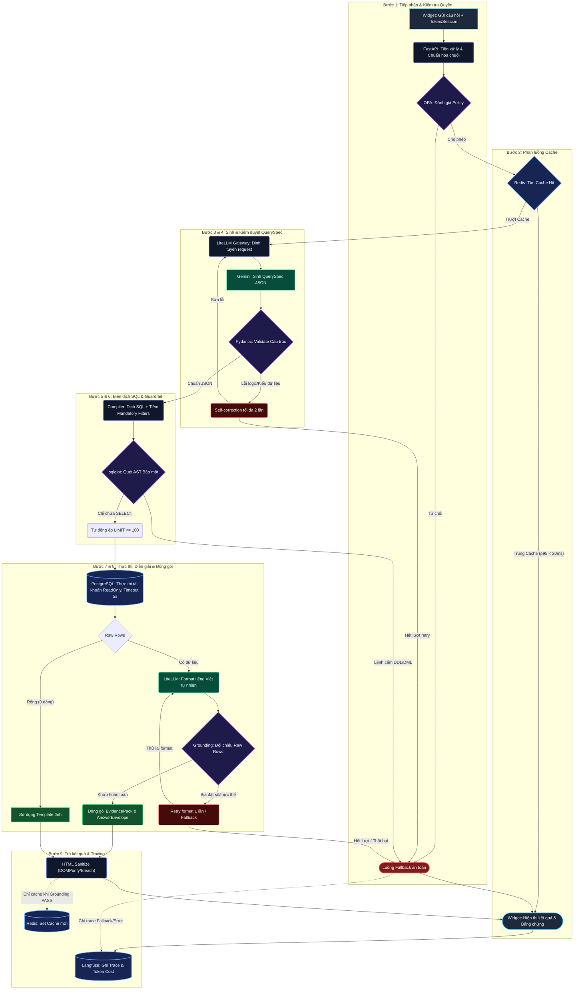

# 🏛️ Kiến Trúc Luồng Xử Lý Truy Vấn Dữ Liệu An Toàn (Production Pipeline)

> Tài liệu chi tiết và ma trận phân tích 9 bước: Xem tại [workflow_pipeline.md](file:///c:/Chat_Widget/documents/workflow_pipeline.md).

