# 🏛️ Kiến Trúc Luồng Xử Lý Truy Vấn Dữ Liệu An Toàn (Production Pipeline)

> Tài liệu chi tiết và ma trận phân tích 9 bước: Xem tại [workflow_pipeline.md](./workflow_pipeline.md).

---

## 🖼️ Hình Ảnh Sơ Đồ Kiến Trúc (Rendered SVG)

---

## 📝 Mã Nguồn Sơ Đồ (Mermaid Source Code)

```mermaid
flowchart TD
    %% ==========================================
    %% BƯỚC 1: TIẾP NHẬN & KIỂM TRA QUYỀN
    %% ==========================================
    subgraph SG1 ["Bước 1: Tiếp nhận & Kiểm tra Quyền"]
        A["Widget: Gửi câu hỏi + Token/Session"]
        B["FastAPI: Tiền xử lý & Chuẩn hóa chuỗi"]
        C{"OPA: Đánh giá Policy"}
        A --> B
        B --> C
    end

    %% ==========================================
    %% BƯỚC 2: PHÂN LUỒNG CACHE
    %% ==========================================
    subgraph SG2 ["Bước 2: Phân luồng Cache"]
        D{"Redis: Tìm Cache Hit"}
    end

    %% ==========================================
    %% BƯỚC 3 & 4: SINH & KIỂM DUYỆT QUERYSPEC
    %% ==========================================
    subgraph SG3 ["Bước 3 & 4: Sinh & Kiểm duyệt QuerySpec"]
        E["LiteLLM Gateway: Định tuyến request"]
        F["Gemini: Sinh QuerySpec JSON"]
        G{"Pydantic: Validate Cấu trúc"}
        H["Self-correction tối đa 2 lần"]
        E --> F
        F --> G
        G -->|Lỗi logic / Kiểu dữ liệu| H
        H -->|Sửa lỗi| E
    end

    %% ==========================================
    %% BƯỚC 5 & 6: BIÊN DỊCH SQL & GUARDRAIL
    %% ==========================================
    subgraph SG4 ["Bước 5 & 6: Biên dịch SQL & Guardrail"]
        I["Compiler: Dịch SQL + Tiêm Mandatory Filters"]
        J{"sqlglot: Quét AST Bảo mật"}
        K["Tự động ép LIMIT tối đa 100"]
        I --> J
        J -->|Chỉ chứa SELECT| K
    end

    %% ==========================================
    %% BƯỚC 7 & 8: THỰC THI, DIỄN GIẢI & ĐÓNG GÓI
    %% ==========================================
    subgraph SG5 ["Bước 7 & 8: Thực thi, Diễn giải & Đóng gói"]
        L[("PostgreSQL: Thực thi tài khoản ReadOnly, Timeout 5s")]
        M{"Raw Rows"}
        N["Sử dụng Template tĩnh"]
        O["LiteLLM: Format tiếng Việt tự nhiên"]
        P{"Grounding: Đối chiếu Raw Rows"}
        Q["Retry format 1 lần / Fallback"]
        R["Đóng gói EvidencePack & AnswerEnvelope"]
        L --> M
        M -->|Rỗng 0 dòng| N
        M -->|Có dữ liệu| O
        O --> P
        P -->|Bịa đặt số / thực thể| Q
        Q -->|Thử lại format| O
        P -->|Khớp hoàn toàn| R
    end

    %% ==========================================
    %% BƯỚC 9: TRẢ KẾT QUẢ & TRACING
    %% ==========================================
    subgraph SG6 ["Bước 9: Trả kết quả & Tracing"]
        S["HTML Sanitize (DOMPurify/Bleach)"]
        T(["Widget: Hiển thị kết quả & Bằng chứng"])
        U[("Redis: Set Cache mới")]
        V[("Langfuse: Ghi Trace & Token Cost")]
        R --> S
        N --> S
        S --> T
        S -.->|Chỉ cache khi Grounding PASS| U
        T --> V
    end

    %% ==========================================
    %% LUỒNG FALLBACK AN TOÀN
    %% ==========================================
    Z(["Luồng Fallback an toàn"])

    %% ==========================================
    %% LIÊN KẾT GIỮA CÁC BƯỚC (CROSS-STEP FLOWS)
    %% ==========================================
    C -->|Cho phép| D
    C -->|Từ chối| Z

    D -->|Trúng Cache p95 dưới 20ms| T
    D -->|Trượt Cache| E

    G -->|Chuẩn JSON| I
    H -->|Hết lượt retry| Z

    J -->|Lệnh cấm DDL/DML| Z
    K --> L

    Q -->|Hết lượt / Thất bại| Z

    Z --> T
    Z -.->|Ghi trace Fallback/Error| V

    %% ==========================================
    %% STYLING & CLASS DEFINITIONS
    %% ==========================================
    classDef client fill:#1e293b,stroke:#38bdf8,stroke-width:2px,color:#f8fafc;
    classDef gateway fill:#0f172a,stroke:#818cf8,stroke-width:2px,color:#f8fafc;
    classDef security fill:#450a0a,stroke:#f87171,stroke-width:2px,color:#fef2f2;
    classDef decision fill:#1e1b4b,stroke:#a855f7,stroke-width:2px,color:#faf5ff;
    classDef llm fill:#064e3b,stroke:#34d399,stroke-width:2px,color:#ecfdf5;
    classDef storage fill:#172554,stroke:#60a5fa,stroke-width:2px,color:#eff6ff;
    classDef fallback fill:#7f1d1d,stroke:#ef4444,stroke-width:2px,color:#fff;
    classDef success fill:#14532d,stroke:#22c55e,stroke-width:2px,color:#f0fdf4;

    class A,T client;
    class B,E,I,S gateway;
    class C,G,J,P decision;
    class H,Q security;
    class F,O llm;
    class D,L,U,V storage;
    class Z fallback;
    class R,N success;
```

