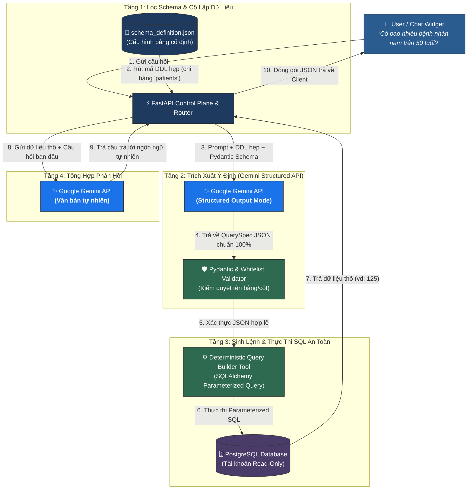

# 🏛️ Kiến Trúc Luồng Xử Lý Truy Vấn Dữ Liệu An Toàn

```mermaid
flowchart TD
    classDef userFill fill:#2b5c8f,stroke:#333,stroke-width:1px,color:#fff;
    classDef coreFill fill:#1e3a5f,stroke:#333,stroke-width:1px,color:#fff;
    classDef geminiFill fill:#1a73e8,stroke:#333,stroke-width:1px,color:#fff;
    classDef dbFill fill:#4a3b68,stroke:#333,stroke-width:1px,color:#fff;
    classDef safeFill fill:#2d6a4f,stroke:#333,stroke-width:1px,color:#fff;

    User["👤 User / Chat Widget<br/><i>'Có bao nhiêu bệnh nhân nam trên 50 tuổi?'</i>"]:::userFill
    
    subgraph Router_Layer ["Tầng 1: Lọc Schema & Cô Lập Dữ Liệu"]
        FastAPI["⚡ FastAPI Control Plane & Router"]:::coreFill
        SchemaJson[("📄 schema_definition.json<br/>(Cấu hình bảng cố định)")]:::coreFill
    end

    subgraph Gemini_Intent_Layer ["Tầng 2: Trích Xuất Ý Định (Gemini Structured API)"]
        GeminiIntent["✨ Google Gemini API<br/><b>(Structured Output Mode)</b>"]:::geminiFill
        PydanticGuard["🛡️ Pydantic & Whitelist Validator<br/>(Kiểm duyệt tên bảng/cột)"]:::safeFill
    end

    subgraph Execution_Layer ["Tầng 3: Sinh Lệnh & Thực Thi SQL An Toàn"]
        QueryBuilder["⚙️ Deterministic Query Builder Tool<br/>(SQLAlchemy Parameterized Query)"]:::safeFill
        Postgres[("🗄️ PostgreSQL Database<br/>(Tài khoản Read-Only)")]:::dbFill
    end

    subgraph Gemini_Summary_Layer ["Tầng 4: Tổng Hợp Phản Hồi"]
        GeminiSummary["✨ Google Gemini API<br/><b>(Văn bản tự nhiên)</b>"]:::geminiFill
    end

    %% Flow Connections
    User -->|"1. Gửi câu hỏi"| FastAPI
    SchemaJson -->|"2. Rút mã DDL hẹp (chỉ bảng 'patients')"| FastAPI
    FastAPI -->|"3. Prompt + DDL hẹp + Pydantic Schema"| GeminiIntent
    GeminiIntent -->|"4. Trả về QuerySpec JSON chuẩn 100%"| PydanticGuard
    PydanticGuard -->|"5. Xác thực JSON hợp lệ"| QueryBuilder
    QueryBuilder -->|"6. Thực thi Parameterized SQL"| Postgres
    Postgres -->|"7. Trả dữ liệu thô (vd: 125)"| FastAPI
    FastAPI -->|"8. Gửi dữ liệu thô + Câu hỏi ban đầu"| GeminiSummary
    GeminiSummary -->|"9. Trả câu trả lời ngôn ngữ tự nhiên"| FastAPI
    FastAPI -->|"10. Đóng gói JSON trả về Client"| User
```