# 🏛️ KIẾN TRÚC LUỒNG XỬ LÝ TRUY VẤN DỮ LIỆU AN TOÀN (END-TO-END PIPELINE)

> **Mô hình kiến trúc:** Defense-in-Depth, Zero Direct LLM SQL, Fail-Closed Security, Deterministic Grounding.  
> **Áp dụng cho:** Hệ thống Chat Widget Y tế & Tra cứu Dữ liệu có Cấu trúc (Structured Data QA).

---

## 1. Sơ Đồ Kiến Trúc Luồng Xử Lý (Workflow Diagram)

```mermaid
flowchart TD
    %% ==========================================
    %% BƯỚC 1: TIẾP NHẬN & KIỂM TRA QUYỀN
    %% ==========================================
    subgraph SG1 ["Bước 1: Tiếp nhận & Kiểm tra Quyền"]
        A["Widget: Gửi câu hỏi + Token/Session"]
        B["FastAPI: Tiền xử lý & Chuẩn hóa chuỗi"]
        C{"OPA: Đánh giá Policy"}
        A --> B
        B --> C
    end

    %% ==========================================
    %% BƯỚC 2: PHÂN LUỒNG CACHE
    %% ==========================================
    subgraph SG2 ["Bước 2: Phân luồng Cache"]
        D{"Redis: Tìm Cache Hit"}
    end

    %% ==========================================
    %% BƯỚC 3 & 4: SINH & KIỂM DUYỆT QUERYSPEC
    %% ==========================================
    subgraph SG3 ["Bước 3 & 4: Sinh & Kiểm duyệt QuerySpec"]
        E["LiteLLM Gateway: Định tuyến request"]
        F["Gemini: Sinh QuerySpec JSON"]
        G{"Pydantic: Validate Cấu trúc"}
        H["Self-correction tối đa 2 lần"]
        E --> F
        F --> G
        G -->|Lỗi logic / Kiểu dữ liệu| H
        H -->|Sửa lỗi| E
    end

    %% ==========================================
    %% BƯỚC 5 & 6: BIÊN DỊCH SQL & GUARDRAIL
    %% ==========================================
    subgraph SG4 ["Bước 5 & 6: Biên dịch SQL & Guardrail"]
        I["Compiler: Dịch SQL + Tiêm Mandatory Filters"]
        J{"sqlglot: Quét AST Bảo mật"}
        K["Tự động ép LIMIT tối đa 100"]
        I --> J
        J -->|Chỉ chứa SELECT| K
    end

    %% ==========================================
    %% BƯỚC 7 & 8: THỰC THI, DIỄN GIẢI & ĐÓNG GÓI
    %% ==========================================
    subgraph SG5 ["Bước 7 & 8: Thực thi, Diễn giải & Đóng gói"]
        L[("PostgreSQL: Thực thi tài khoản ReadOnly, Timeout 5s")]
        M{"Raw Rows"}
        N["Sử dụng Template tĩnh"]
        O["LiteLLM: Format tiếng Việt tự nhiên"]
        P{"Grounding: Đối chiếu Raw Rows"}
        Q["Retry format 1 lần / Fallback"]
        R["Đóng gói EvidencePack & AnswerEnvelope"]
        L --> M
        M -->|Rỗng 0 dòng| N
        M -->|Có dữ liệu| O
        O --> P
        P -->|Bịa đặt số / thực thể| Q
        Q -->|Thử lại format| O
        P -->|Khớp hoàn toàn| R
    end

    %% ==========================================
    %% BƯỚC 9: TRẢ KẾT QUẢ & TRACING
    %% ==========================================
    subgraph SG6 ["Bước 9: Trả kết quả & Tracing"]
        S["HTML Sanitize (DOMPurify/Bleach)"]
        T(["Widget: Hiển thị kết quả & Bằng chứng"])
        U[("Redis: Set Cache mới")]
        V[("Langfuse: Ghi Trace & Token Cost")]
        R --> S
        N --> S
        S --> T
        S -.->|Chỉ cache khi Grounding PASS| U
        T --> V
    end

    %% ==========================================
    %% LUỒNG FALLBACK AN TOÀN
    %% ==========================================
    Z(["Luồng Fallback an toàn"])

    %% ==========================================
    %% LIÊN KẾT GIỮA CÁC BƯỚC (CROSS-STEP FLOWS)
    %% ==========================================
    C -->|Cho phép| D
    C -->|Từ chối| Z

    D -->|Trúng Cache p95 dưới 20ms| T
    D -->|Trượt Cache| E

    G -->|Chuẩn JSON| I
    H -->|Hết lượt retry| Z

    J -->|Lệnh cấm DDL/DML| Z
    K --> L

    Q -->|Hết lượt / Thất bại| Z

    Z --> T
    Z -.->|Ghi trace Fallback/Error| V

    %% ==========================================
    %% STYLING & CLASS DEFINITIONS
    %% ==========================================
    classDef client fill:#1e293b,stroke:#38bdf8,stroke-width:2px,color:#f8fafc;
    classDef gateway fill:#0f172a,stroke:#818cf8,stroke-width:2px,color:#f8fafc;
    classDef security fill:#450a0a,stroke:#f87171,stroke-width:2px,color:#fef2f2;
    classDef decision fill:#1e1b4b,stroke:#a855f7,stroke-width:2px,color:#faf5ff;
    classDef llm fill:#064e3b,stroke:#34d399,stroke-width:2px,color:#ecfdf5;
    classDef storage fill:#172554,stroke:#60a5fa,stroke-width:2px,color:#eff6ff;
    classDef fallback fill:#7f1d1d,stroke:#ef4444,stroke-width:2px,color:#fff;
    classDef success fill:#14532d,stroke:#22c55e,stroke-width:2px,color:#f0fdf4;

    class A,T client;
    class B,E,I,S gateway;
    class C,G,J,P decision;
    class H,Q security;
    class F,O llm;
    class D,L,U,V storage;
    class Z fallback;
    class R,N success;
```

---

## 2. Bảng Ma Trận Chi Tiết Các Bước Xử Lý (Pipeline Matrix)

| Bước | Phân đoạn | Module chịu trách nhiệm | Dữ liệu đầu vào (Input) | Dữ liệu đầu ra (Output) | Cơ chế An toàn & Guardrails | Hành vi khi lỗi / Bất thường |
| :---: | :--- | :--- | :--- | :--- | :--- | :--- |
| **1** | **Tiếp nhận & Kiểm tra quyền** | FastAPI Control Plane, OPA (Open Policy Agent) | Câu hỏi thô từ người dùng + Auth Token / Session ID | Chuỗi câu hỏi đã chuẩn hóa + Context người dùng hợp lệ | Xác thực danh tính, kiểm tra quyền ABAC/RBAC, chặn IP xấu, giới hạn Rate Limit | Chuyển ngay sang **Luồng Fallback an toàn (Z)**: Thông báo từ chối truy cập, ghi audit log |
| **2** | **Phân luồng Cache** | Redis In-Memory Cache | Hash chuẩn hóa của câu hỏi (`cache:exact:{hash}`) | **Hit:** Payload kết quả hoàn chỉnh **Miss:** Chuyển tiếp sang LLM | Kiểm tra TTL, kiểm tra tính hợp lệ của cache version, cách ly cache giữa các tenant/vai trò | **Hit:** Trả thẳng về Widget (p95 < 20ms) **Miss:** Chuyển sang Bước 3 |
| **3** | **Sinh QuerySpec** | LiteLLM Gateway, Google Gemini API | Câu hỏi đã chuẩn hóa + Schema Metadata rút gọn (không lộ DB vật lý) | Chuỗi JSON chứa cấu trúc `QuerySpec` thô | JSON Mode bắt buộc (`response_mime_type: application/json`), nhiệt độ thấp (temperature = 0) | Timeout sau 5s, gọi dự phòng model khác hoặc kích hoạt self-correction |
| **4** | **Kiểm duyệt QuerySpec** | Pydantic Schema Validator | Chuỗi JSON thô từ Gemini | Object `QuerySpec` kiểu mạnh (Strictly Typed) | Bắt lỗi enum, cấm cột không tồn tại trong metadata, cấm phép toán trái phép | Kích hoạt vòng lặp **Self-correction** (tối đa 2 lần). Nếu vẫn lỗi: sang Fallback (Z) |
| **5** | **Biên dịch SQL** | Deterministic SQL Compiler | Object `QuerySpec` hợp lệ | Câu lệnh SQL có tham số hóa (Parameterized SQL) | Tự động tiêm bộ lọc bắt buộc (Mandatory Filters: tenant_id, status, scope), không ghép chuỗi SQL trực tiếp | Báo lỗi biên dịch, đưa thông tin lỗi vào Self-correction hoặc Fallback |
| **6** | **Guardrail AST SQL** | `sqlglot` Security Inspector | Chuỗi SQL đã biên dịch | Safe SQL sẵn sàng thực thi | Quét cây cú pháp trừu tượng (AST): • Node gốc bắt buộc là `SELECT` • Khóa chặt mọi lệnh DDL/DML (`DROP`, `DELETE`, `UPDATE`, `INSERT`, `ALTER`, `TRUNCATE`,...) • Tự động ép `LIMIT <= 100` | Nếu phát hiện lệnh cấm: **Chặn lập tức**, chuyển sang Fallback (Z), ghi log cảnh báo an ninh |
| **7** | **Thực thi SQL** | PostgreSQL Database Engine | Safe SQL Parameterized | Danh sách dòng dữ liệu thô (`Raw Rows: List[Dict]`) | • Tài khoản DB chuyên dụng `readonly` • Thiết lập `statement_timeout = 5s` • Cách ly kết nối bằng connection pool | Lỗi DB / Timeout: Hủy truy vấn, chuyển sang Fallback thông báo hệ thống bận |
| **8** | **Diễn giải & Grounding** | LiteLLM (Format NL), Deterministic Grounding Engine | `Raw Rows` + Câu hỏi người dùng | Bản thảo câu trả lời (Draft Answer) + `EvidencePack` & `AnswerEnvelope` | • **Nếu 0 dòng:** Dùng Template tĩnh cố định (không gọi LLM) • **Nếu có dòng:** Gemini format tiếng Việt tự nhiên • **Grounding Deterministic:** So khớp 100% số liệu, tên thực thể giữa câu trả lời và `Raw Rows` | Nếu phát hiện ảo giác (bịa đặt số liệu/thực thể): Retry format 1 lần; nếu vẫn sai -> Fallback / trả bảng thô kèm Template an toàn |
| **9** | **Trả kết quả & Tracing** | HTML Sanitizer (DOMPurify/Bleach), Redis, Langfuse | `AnswerEnvelope` + `EvidencePack` | Render an toàn trên Chat Widget (Shadow DOM) | Xóa triệt để các thẻ `<script>`, `<iframe>`, sự kiện inline `onclick`, ngăn chặn triệt để XSS | Ghi toàn bộ Span, Token Cost, Trạng thái (Hit, Miss, Fallback, Denied, Latency) lên Langfuse |

---

## 3. Các Nguyên Tắc Thiết Kế Cốt Lõi (Architectural Guarantees)

### 3.1. Nguyên tắc "Không tin tưởng LLM" (Zero Trust LLM)
- **Không sinh SQL trực tiếp:** LLM chỉ được phép sinh cấu trúc trung gian `QuerySpec` dạng JSON theo chuẩn Pydantic.
- **Biên dịch độc lập:** Backend nội bộ tự kiểm soát việc dịch từ `QuerySpec` sang SQL và tự động nhúng các điều kiện ràng buộc quyền dữ liệu (Mandatory Scope).
- **Kiểm tra cú pháp độc lập (AST Guard):** `sqlglot` phân tích cây cú pháp trừu tượng để đảm bảo không một câu lệnh sửa đổi dữ liệu (DDL/DML) nào có thể lọt qua.

### 3.2. Cơ chế Self-Correction có kiểm soát (Bounded Self-Correction)
- **Tối đa 2 lần retry** (tổng cộng tối đa 3 lần gọi LLM).
- Gom toàn bộ thông báo lỗi có cấu trúc từ Pydantic hoặc `sqlglot` để nạp ngược lại cho model hiểu lý do vi phạm.
- **Chặn đứng vòng lặp vô tận:** Khi hết 2 lượt sửa mà vẫn không đạt chuẩn, hệ thống tự động ngắt và chuyển sang **Luồng Fallback an toàn (Z)**.

### 3.3. Đối soát Dữ liệu tất định (Deterministic Grounding)
- Tuyệt đối **không** dùng một LLM khác để "chấm điểm" tính đúng/sai.
- Thuật toán trích xuất toàn bộ tập số liệu và thực thể từ `Raw Rows` (IDs, ngày tháng, tên bệnh nhân, số lượng count, v.v.).
- Nếu câu trả lời chứa bất kỳ con số hoặc thực thể lạ nào không tồn tại trong `Raw Rows`, hệ thống đánh dấu **FAIL Grounding**.

### 3.4. Nguyên tắc Lưu Cache Nghiêm Ngặt (Safe Caching Policy)
- **Chỉ lưu cache:** Những yêu cầu đã vượt qua Grounding thành công 100%.
- **Tuyệt đối không lưu cache:** Các yêu cầu rơi vào Fallback, Timeout, Injection bị chặn, câu hỏi bị từ chối hoặc kết quả Grounding Fail.

### 3.5. Giám sát Toàn diện (Full Observability with Langfuse)
- Tất cả các yêu cầu dù thành công, thất bại, hit cache, hay bị từ chối quyền đều được đẩy bất đồng bộ (Async) lên **Langfuse**.
- Theo dõi chi tiết: Latency từng span, số lần retry, câu lệnh SQL thực tế, số token tiêu thụ và chi phí ước tính.
