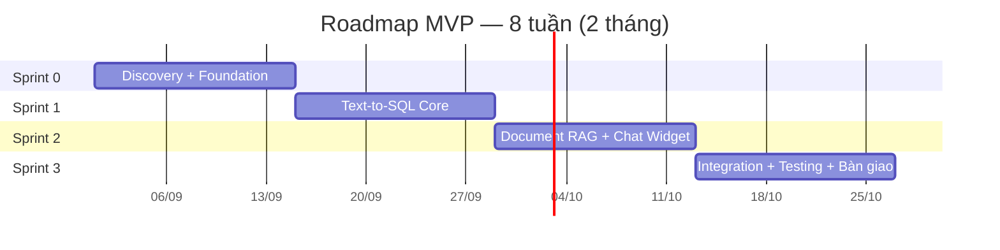

# Thiết Kế Lại Sprint Plan: 24 tuần → 8 tuần (2 tháng)

## Bối cảnh

Khách hàng yêu cầu bàn giao MVP trong **2 tháng (8 tuần)**. Plan hiện tại trong [project_analysis.md](file:///c:/Chat_Widget/project_analysis.md) thiết kế cho 24 tuần (16 sprints). Cần nén xuống **4 sprints × 2 tuần = 8 tuần**, tập trung vào giá trị cốt lõi, hoãn phần mở rộng cho giai đoạn sau.

## User Review Required

> [!IMPORTANT]
> **Chiến lược nén**: Thay vì cắt bỏ hoàn toàn các phase, mỗi sprint sẽ **gộp nhiều phase** và chỉ giữ lại những task thiết yếu nhất. Các tính năng nâng cao sẽ nằm trong **Post-MVP Roadmap** để phát triển dần.

> [!WARNING]
> **Những gì sẽ bị hoãn lại sau MVP**:
> - OPA Policy Engine nâng cao (ABAC) → dùng RBAC đơn giản trước
> - Semantic Catalog đầy đủ (lifecycle Draft→Published) → dùng config file/DB tĩnh
> - Malware scan, ACL-aware retrieval nâng cao
> - Admin UI đầy đủ → dùng API + Swagger UI thay thế
> - Security hardening toàn diện (Phase 5)
> - Multi-project support (Phase 6)
> - Mixed questions (kết hợp data + document)
> - Maker-checker workflow

## Proposed Changes

### Phần thay đổi trong [project_analysis.md](file:///c:/Chat_Widget/project_analysis.md)

Thay thế toàn bộ **Section 5 (Sprint Design)**, **Section 6 (Sprint Board)** và **Section 7 (Lời khuyên)** bằng nội dung mới:

---

### Sprint Plan mới — 4 Sprint, 8 tuần

---

#### 🔵 Sprint 0 — Discovery + Foundation (Tuần 1-2)

**Gộp Phase 0 + Phase 1 + Phase 2 (nền móng)**

Mục tiêu: Chốt scope, setup project, xong IAM cơ bản + DB schema. Kết thúc sprint có API skeleton chạy được.

| Task | Mô tả | Ưu tiên |
|---|---|---|
| Chọn pilot + Golden Questions | 1 dự án, 2-3 roles, 15-20 câu hỏi mẫu | 🔴 P0 |
| Định nghĩa 5-7 KPI chính | Metric + dimension tối thiểu | 🔴 P0 |
| Chuẩn bị 10-15 tài liệu mẫu | PDF/Word cho RAG test | 🔴 P0 |
| Setup project Python (modular) | Cấu trúc thư mục, FastAPI skeleton | 🔴 P0 |
| DB schema + Alembic migration | PostgreSQL + pgvector extension | 🔴 P0 |
| IAM cơ bản | JWT validation, tạo IdentityContext | 🔴 P0 |
| RBAC đơn giản | Role-based check (không cần OPA) | 🔴 P0 |
| LiteLLM setup | Kết nối Gemini/GPT, test routing | 🔴 P0 |
| CI/CD + Docker Compose | Dev environment chạy 1 lệnh | 🟡 P1 |
| Health check endpoints | `/health/live`, `/health/ready` | 🟡 P1 |

**🚪 Gate G0**: API skeleton chạy, JWT validation hoạt động, DB connected, LLM callable.

---

#### 🟢 Sprint 1 — Structured Data Q&A (Tuần 3-4)

**Gộp Phase 3A (nén từ 5 tuần → 2 tuần)**

Mục tiêu: Người dùng hỏi bằng tiếng Việt → hệ thống trả đúng số liệu từ database. Đây là **giá trị cốt lõi #1**.

| Task | Mô tả | Ưu tiên |
|---|---|---|
| Schema Catalog (đơn giản) | Bảng cấu hình metric/dimension trong DB, không cần lifecycle phức tạp | 🔴 P0 |
| Query Planner | LLM chuyển câu hỏi → QuerySpec (JSON) | 🔴 P0 |
| Pydantic validation cho QuerySpec | Validate cấu trúc đầu ra LLM | 🔴 P0 |
| SQL Compiler | QuerySpec → parameterized SQL | 🔴 P0 |
| Safety Guard | Chặn DDL/DML, chỉ cho SELECT/WITH, statement timeout | 🔴 P0 |
| Read-only DB execution | Chạy SQL bằng tài khoản read-only | 🔴 P0 |
| Evidence cơ bản | Gắn SQL đã chạy + metadata vào response | 🔴 P0 |
| Xử lý câu hỏi không hợp lệ | Từ chối lịch sự, không đoán bừa | 🟡 P1 |
| Test với Golden Questions | ≥ 80% accuracy trên 15-20 câu hỏi | 🔴 P0 |

**🚪 Gate G1**: 5 KPI trọng yếu chính xác 100%. Overall accuracy ≥ 80%. Không có DDL/DML.

---

#### 🟡 Sprint 2 — Document RAG + Chat Widget (Tuần 5-6)

**Gộp Phase 3B + Phase 4 (nén từ 8 tuần → 2 tuần)**

Mục tiêu: Upload tài liệu → hỏi đáp → trả lời có trích dẫn. Chat Widget nhúng web hoạt động.

| Task | Mô tả | Ưu tiên |
|---|---|---|
| Upload pipeline | Validate file (PDF/Word/TXT), lưu Object Storage | 🔴 P0 |
| Text extraction + Chunking | Trích xuất text, chia chunk, gắn metadata | 🔴 P0 |
| Embedding + pgvector | Generate embedding, lưu vector store | 🔴 P0 |
| Retrieval (vector search) | Tìm chunk liên quan dựa trên câu hỏi | 🔴 P0 |
| RAG Answer generation | LLM đọc chunks + câu hỏi → tạo câu trả lời | 🔴 P0 |
| Citation cơ bản | Trỏ đến document_id, page/section | 🔴 P0 |
| Chat Widget (Web Component) | Giao diện chat nhúng vào website | 🔴 P0 |
| SSE streaming | Câu trả lời hiện từ từ như ChatGPT | 🔴 P0 |
| Orchestrator đơn giản | Phân loại: hỏi data / hỏi tài liệu / không hợp lệ | 🔴 P0 |
| Responsive layout | Desktop + mobile cơ bản | 🟡 P1 |

**🚪 Gate G2**: RAG hoạt động end-to-end. Chat Widget hiển thị đúng. SSE streaming chạy. Citation trỏ đúng document.

---

#### 🔴 Sprint 3 — Integration + Testing + Bàn giao (Tuần 7-8)

**Gộp Phase 4 (phần còn lại) + Phase 5 (rút gọn)**

Mục tiêu: Tích hợp toàn bộ, test bảo mật cơ bản, fix bug, chuẩn bị bàn giao.

| Task | Mô tả | Ưu tiên |
|---|---|---|
| E2E integration test | Luồng hoàn chỉnh: login → hỏi → trả lời → evidence | 🔴 P0 |
| Answer Envelope | Response format thống nhất: answer + evidence + scope | 🔴 P0 |
| Security test cơ bản | Token giả → reject, SQL injection → blocked, read-only verified | 🔴 P0 |
| Golden Dataset regression | Chạy lại toàn bộ câu hỏi test, đo accuracy | 🔴 P0 |
| Bug fixing + polish | Sửa lỗi UI, edge cases, error handling | 🔴 P0 |
| Feedback button | User đánh giá 👍/👎 câu trả lời | 🟡 P1 |
| Basic monitoring | Logging, error tracking, response time | 🟡 P1 |
| Documentation | API docs, deployment guide, user guide | 🔴 P0 |
| Deploy staging | Triển khai môi trường staging cho khách review | 🔴 P0 |
| Bàn giao + Demo | Demo cho khách hàng, handover | 🔴 P0 |

**🚪 Gate G3 (Bàn giao MVP)**:
- ✅ Luồng E2E hoạt động: hỏi data + hỏi tài liệu
- ✅ Chat Widget nhúng được vào website
- ✅ JWT auth hoạt động, RBAC cơ bản
- ✅ SQL chỉ read-only, chặn DDL/DML
- ✅ Golden Dataset accuracy ≥ 80%
- ✅ Có documentation đầy đủ

---

### Sprint Board tóm tắt (8 tuần)

| Sprint | Tuần | Deliverable chính | Trọng tâm |
|---|---|---|---|
| 0 | 1-2 | API skeleton, IAM, DB, LLM connected | Foundation |
| 1 | 3-4 | Text-to-SQL hoạt động, accuracy ≥ 80% | Core Value #1 |
| 2 | 5-6 | RAG + Chat Widget + SSE streaming | Core Value #2 + UI |
| 3 | 7-8 | E2E test, bug fix, deploy, bàn giao | Delivery |

---

### Post-MVP Roadmap (sau bàn giao)

Sau khi bàn giao MVP, phát triển tiếp theo ưu tiên:

| Ưu tiên | Tính năng | Mô tả |
|---|---|---|
| 🔴 P0 | OPA Policy Engine | ABAC nâng cao, policy phức tạp |
| 🔴 P0 | Semantic Catalog đầy đủ | Lifecycle Draft→Published, synonym, relationship |
| 🔴 P0 | ACL-aware retrieval | Filter quyền TRƯỚC khi search |
| 🟡 P1 | Admin UI | Giao diện quản trị project, catalog, documents |
| 🟡 P1 | Mixed questions | Kết hợp data + document trong 1 câu trả lời |
| 🟡 P1 | Security hardening | Penetration test, prompt injection defense |
| 🟢 P2 | Multi-project | Onboard project thứ 2+ bằng config |
| 🟢 P2 | Audit trail đầy đủ | Compliance-grade logging |

---

## Open Questions

> [!IMPORTANT]
> 1. **Đội ngũ bao nhiêu người?** Nếu < 3 người, Sprint 2 (RAG + Widget cùng lúc) sẽ rất căng — có thể cần giảm scope Widget xuống chỉ còn HTML/JS cơ bản.
> 2. **Khách hàng ưu tiên Text-to-SQL hay Document RAG hơn?** Nếu chỉ cần 1 trong 2 cho MVP, có thể dồn 2 sprint cho phần đó và hoãn phần còn lại.
> 3. **Deployment target?** On-premise hay cloud? Ảnh hưởng đến Sprint 3 (deploy).

## Verification Plan

### Automated Tests
- Chạy Golden Dataset (15-20 câu), đo accuracy
- Security smoke test: token giả, SQL injection

### Manual Verification
- Demo luồng E2E trên staging
- Review tài liệu với khách hàng
