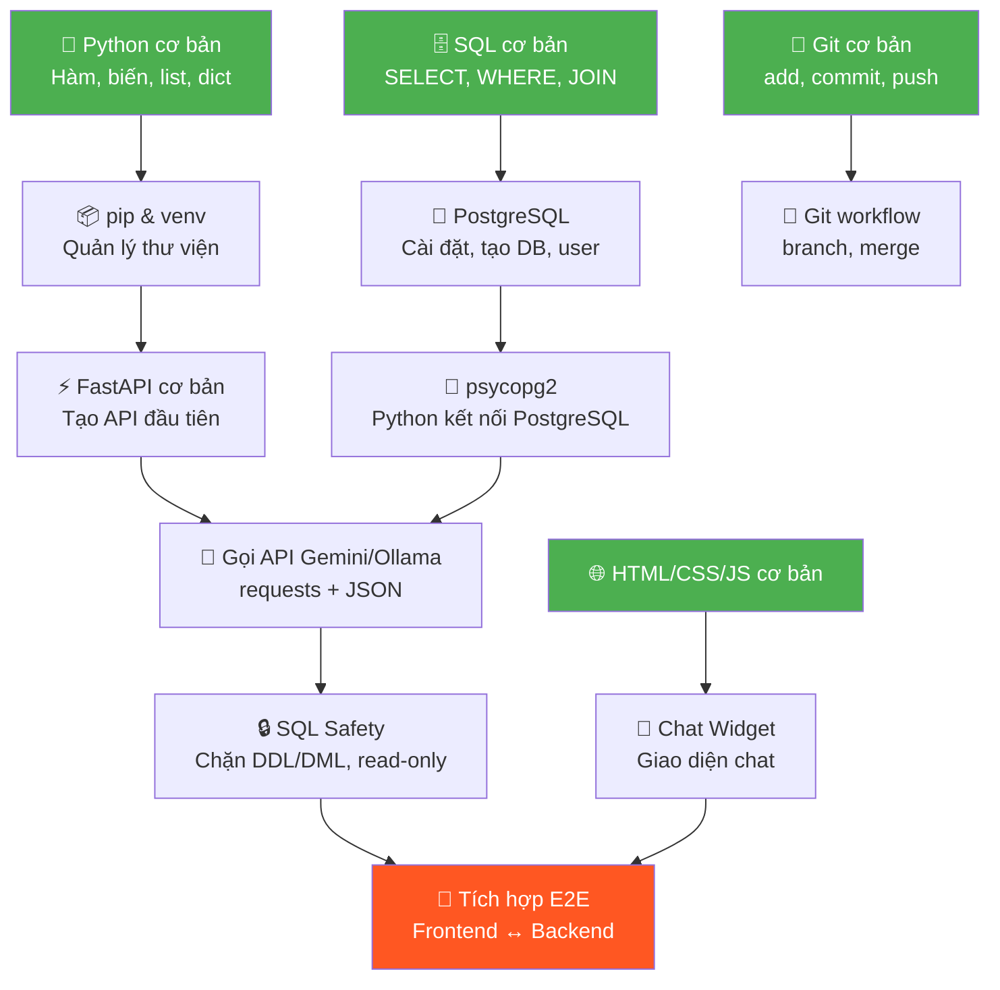

# 🎓 Lộ Trình Học Tập & Thực Hành Cá Nhân — Dự Án Chat Widget

> **Dành cho bạn** — một sinh viên với học lực trung bình yếu, nhưng có quyết tâm hoàn thành dự án.
> Tài liệu này được viết với triết lý: **"Học vừa đủ để làm việc tiếp theo"** — không cần giỏi tất cả, chỉ cần hiểu đúng thứ cần làm.

---

## 📊 Đánh Giá Nền Tảng — Bạn Đang Ở Đâu?

Trước khi bắt đầu, hãy tự đánh giá trung thực (đánh dấu ✅ hoặc ❌):

| # | Kỹ năng | Mức độ yêu cầu | Tự đánh giá |
|---|---|---|---|
| 1 | Viết được hàm Python cơ bản (`def`, `if`, `for`, `list`, `dict`) | 🔴 Bắt buộc | ☐ |
| 2 | Hiểu SQL cơ bản (`SELECT`, `WHERE`, `JOIN`, `COUNT`) | 🔴 Bắt buộc | ☐ |
| 3 | Dùng được Git (`clone`, `add`, `commit`, `push`) | 🔴 Bắt buộc | ☐ |
| 4 | Hiểu HTTP request/response (GET, POST, JSON) | 🟡 Cần học | ☐ |
| 5 | Biết HTML/CSS/JavaScript cơ bản | 🟡 Cần học | ☐ |
| 6 | Dùng được terminal/command line | 🔴 Bắt buộc | ☐ |
| 7 | Biết dùng Docker | 🟢 Học sau cũng được | ☐ |
| 8 | Hiểu API là gì, REST API | 🟡 Cần học | ☐ |

> [!TIP]
> **Nếu bạn đánh ❌ ở mục 1-3**: Dành **1 tuần trước khi bắt đầu dự án** để ôn lại. Đây là nền tảng không thể bỏ qua.
> **Nếu bạn đánh ❌ ở mục 4-6**: Đừng lo, roadmap bên dưới sẽ dạy bạn từng bước.

---

## 🌳 Cây Kỹ Năng — Học Gì Trước, Học Gì Sau?



> 🟢 Xanh = Nền tảng (học trước) → 🔴 Đỏ = Mục tiêu cuối (tích hợp)

---

## 📅 Lịch Trình 8 Tuần Chi Tiết

### ⏰ Mẫu lịch học hàng ngày (2-3 giờ/ngày)

```
🌅 Buổi sáng (30 phút):   Xem video/đọc lý thuyết
🌞 Buổi chiều (1-1.5 giờ): Thực hành mini-exercise
🌙 Buổi tối (30-60 phút):  Áp dụng vào dự án thật
```

> [!IMPORTANT]
> **Quy tắc vàng**: Mỗi ngày phải có **ít nhất 1 commit** vào Git, dù chỉ sửa 1 dòng. Thói quen > Hoàn hảo.

---

## 🟢 PRE-SPRINT (Tuần 0 — Nếu nền tảng yếu)

> **Mục tiêu**: Ôn lại Python + SQL + Git đủ để bắt đầu dự án. Nếu bạn đã vững 3 thứ này, nhảy thẳng Sprint 0.

### Ngày 1-2: Python cơ bản

**📺 Xem video (chọn 1):**
- [Kteam - Lập trình Python cơ bản](https://www.youtube.com/playlist?list=PL33lvabfss1xczCv2BA0SaNJHu_VXsFtg) — Tiếng Việt, dễ hiểu
- [Programming with Mosh - Python for Beginners](https://www.youtube.com/watch?v=kqtD5dpn9C8) — 6 giờ, rất hay

**✍️ Bài tập tự kiểm tra** (làm trong file `scratch_python.py`):
```python
# Bài 1: Viết hàm nhận tên → trả về lời chào
def chao(ten):
    return f"Xin chào {ten}!"

# Bài 2: Viết hàm nhận list số → trả về tổng số chẵn
def tong_so_chan(numbers):
    return sum(n for n in numbers if n % 2 == 0)

# Bài 3: Viết hàm nhận dict → tìm key có value lớn nhất
def tim_max(data):
    return max(data, key=data.get)

# TEST: Nếu 3 bài này bạn tự viết được → đủ để bắt đầu dự án
print(chao("Nam"))                           # "Xin chào Nam!"
print(tong_so_chan([1, 2, 3, 4, 5, 6]))     # 12
print(tim_max({"a": 10, "b": 30, "c": 20})) # "b"
```

> ✅ **Checkpoint**: Viết được 3 hàm trên **không cần Google** → Đạt

---

### Ngày 3-4: SQL cơ bản

**📺 Xem video:**
- [Kteam - SQL cơ bản](https://www.youtube.com/playlist?list=PL33lvabfss1xnFpWQF6YH568UuMcBzgWE) — Tiếng Việt
- Hoặc thực hành trực tiếp: [SQLBolt.com](https://sqlbolt.com/) — 18 bài tương tác, miễn phí

**✍️ Bài tập tự kiểm tra** (viết trên giấy hoặc SQLBolt):
```sql
-- Bài 1: Đếm số bệnh nhân nam
SELECT COUNT(*) FROM patients WHERE gender = 'Nam';

-- Bài 2: Tìm 5 lần khám tốn nhất
SELECT * FROM visits ORDER BY total_cost DESC LIMIT 5;

-- Bài 3: Đếm số lần khám theo bác sĩ
SELECT d.full_name, COUNT(v.visit_id) AS so_lan_kham
FROM doctors d JOIN visits v ON d.doctor_id = v.doctor_id
GROUP BY d.full_name ORDER BY so_lan_kham DESC;
```

> ✅ **Checkpoint**: Viết được câu JOIN + GROUP BY → Đạt

---

### Ngày 5: Git cơ bản

**📺 Xem video:** [Thành Phạm - Git cho người mới bắt đầu](https://www.youtube.com/watch?v=1JuYQgpbrW0)

**✍️ Thực hành ngay trên dự án:**
```bash
# Kiểm tra repo hiện tại
cd C:\Chat_Widget
git status
git log --oneline -5

# Tạo branch mới cho công việc của bạn
git checkout -b feature/sprint-0

# Sau khi sửa gì đó
git add .
git commit -m "sprint-0: setup project"
git push origin feature/sprint-0
```

**6 lệnh Git cần nhớ suốt đời:**

| Lệnh | Ý nghĩa | Khi nào dùng |
|---|---|---|
| `git status` | Xem file nào thay đổi | **Trước khi commit** |
| `git add .` | Chọn tất cả file để commit | Sau khi sửa code |
| `git commit -m "..."` | Lưu thay đổi với ghi chú | Mỗi khi xong 1 việc nhỏ |
| `git push` | Đẩy lên server | Cuối ngày hoặc khi xong task |
| `git pull` | Kéo code mới nhất về | Đầu ngày |
| `git log --oneline -10` | Xem 10 lần commit gần nhất | Khi cần xem lại lịch sử |

> ✅ **Checkpoint**: Commit + push được lên GitHub → Đạt

---

### Ngày 6-7: HTTP & API là gì?

**📺 Xem video:** [Fireship - 100 seconds of REST](https://www.youtube.com/watch?v=-MTSQjw5DrM)

**🧠 Tóm tắt cần nhớ:**

```
Client (trình duyệt/app)  ──── HTTP Request ────▸  Server (FastAPI)
                           ◂── HTTP Response ───

Request gồm:
  - Method: GET (lấy dữ liệu) | POST (gửi dữ liệu)
  - URL: http://localhost:8000/chat
  - Body (JSON): {"question": "Có bao nhiêu bệnh nhân?"}

Response gồm:
  - Status: 200 (OK) | 404 (Không tìm thấy) | 500 (Lỗi server)
  - Body (JSON): {"status": "success", "data": [...]}
```

**✍️ Thực hành:**
```python
# Cài thư viện
# pip install requests

import requests

# Thử gọi 1 API công khai
response = requests.get("https://api.github.com")
print(response.status_code)  # 200
print(response.json())       # {...}

# Đây chính xác là cách backend của bạn sẽ gọi Gemini API!
```

> ✅ **Checkpoint**: Hiểu GET vs POST, JSON là gì → Đạt

---

## 🔵 SPRINT 0 — Foundation (Tuần 1-2)

### 🎯 Mục tiêu tuần này
> Kết thúc tuần 2, bạn phải có: **FastAPI chạy được, kết nối được PostgreSQL, gọi được Gemini API**.
> Thực ra... bạn đã có code này rồi! File `chatwidget_backend_fastapi.py` đã làm tất cả. Nhiệm vụ là **hiểu từng dòng code**.

---

### Tuần 1 — Hiểu code hiện tại + Setup môi trường

#### Ngày 1-2: Đọc hiểu code backend hiện tại

**📚 Nhiệm vụ**: Mở file [chatwidget_backend_fastapi.py](file:///c:/Chat_Widget/chatwidget_backend_fastapi.py) và trả lời được những câu hỏi sau:

| # | Câu hỏi | Gợi ý tìm ở dòng |
|---|---|---|
| 1 | FastAPI app được tạo ở đâu? | Dòng 59-63 |
| 2 | Khi người dùng gửi câu hỏi, dữ liệu đi vào hàm nào? | Dòng 269 (`chat_endpoint`) |
| 3 | Hàm nào lấy danh sách bảng từ database? | Dòng 82 (`get_database_schema`) |
| 4 | Hàm nào gọi Gemini AI? | Dòng 142 (`ask_gemini_to_write_sql`) |
| 5 | Hàm nào chạy câu SQL vào database? | Dòng 227 (`execute_sql_safely`) |
| 6 | Bảo vệ SQL injection ở đâu? | Dòng 233-235 |
| 7 | CORS middleware làm gì? | Dòng 66-72 |
| 8 | `ChatInput` model dùng Pydantic để làm gì? | Dòng 76-78 |

**💡 Mẹo đọc code**: Đọc theo **luồng dữ liệu**, không đọc từ trên xuống dưới:
```
chat_endpoint() → get_database_schema() → ask_gemini_to_write_sql() → execute_sql_safely() → return JSON
```

**✍️ Bài tập**: Vẽ lại sơ đồ 8 bước trên giấy A4, mỗi bước ghi tên hàm tương ứng.

---

#### Ngày 3-4: FastAPI crash course

**📺 Xem video:** [Code With Mosh - FastAPI Tutorial](https://www.youtube.com/watch?v=IKNFN2FMR9M) (1 giờ)

**✍️ Mini-exercise**: Tạo file `learn_fastapi.py`:
```python
from fastapi import FastAPI
from pydantic import BaseModel

app = FastAPI()

# Bài 1: API đơn giản nhất
@app.get("/")
def home():
    return {"message": "Hello World"}

# Bài 2: Nhận dữ liệu từ URL
@app.get("/greet/{name}")
def greet(name: str):
    return {"message": f"Xin chào {name}!"}

# Bài 3: Nhận dữ liệu từ body (giống chat endpoint của bạn)
class Question(BaseModel):
    text: str

@app.post("/ask")
def ask(q: Question):
    return {"you_asked": q.text, "answer": "Tôi chưa biết trả lời!"}

# Chạy: uvicorn learn_fastapi:app --reload
# Mở: http://localhost:8000/docs  ← Swagger UI tự động!
```

**Chạy thử:**
```bash
pip install fastapi uvicorn
uvicorn learn_fastapi:app --reload
```

Mở trình duyệt: `http://localhost:8000/docs` → Thử gửi request ngay trên giao diện!

> ✅ **Checkpoint**: Swagger UI hiện lên, gửi POST request được → Đạt

---

#### Ngày 5-6: PostgreSQL setup

**📺 Xem video:** [Kteam - Cài đặt PostgreSQL](https://www.youtube.com/watch?v=wTsT0GT2gBo) — Tiếng Việt

**Bước 1: Cài PostgreSQL**
- Tải từ: https://www.postgresql.org/download/windows/
- Ghi nhớ password bạn đặt cho user `postgres`!

**Bước 2: Tạo database y tế**
```sql
-- Mở pgAdmin hoặc psql, chạy:
CREATE DATABASE medical_db;

-- Tạo tài khoản read-only cho AI
CREATE USER ai_agent WITH PASSWORD 'secure_ai_password_123';
GRANT CONNECT ON DATABASE medical_db TO ai_agent;

-- Kết nối vào medical_db
\c medical_db

-- Tạo bảng
CREATE TABLE patients (
    patient_id SERIAL PRIMARY KEY,
    full_name VARCHAR(100),
    gender VARCHAR(10),
    date_of_birth DATE,
    phone_number VARCHAR(15)
);

CREATE TABLE doctors (
    doctor_id SERIAL PRIMARY KEY,
    full_name VARCHAR(150),
    specialty VARCHAR(50)
);

CREATE TABLE visits (
    visit_id SERIAL PRIMARY KEY,
    patient_id INTEGER REFERENCES patients(patient_id),
    doctor_id INTEGER REFERENCES doctors(doctor_id),
    visit_date DATE,
    diagnosis TEXT,
    total_cost NUMERIC(10,2)
);

-- Cấp quyền đọc cho ai_agent
GRANT SELECT ON ALL TABLES IN SCHEMA public TO ai_agent;
ALTER DEFAULT PRIVILEGES IN SCHEMA public GRANT SELECT ON TABLES TO ai_agent;

-- Thêm dữ liệu mẫu
INSERT INTO patients (full_name, gender, date_of_birth, phone_number) VALUES
('Nguyễn Văn A', 'Nam', '1990-05-15', '0901234567'),
('Trần Thị B', 'Nữ', '1985-11-20', '0912345678'),
('Lê Văn C', 'Nam', '2000-03-10', '0923456789'),
('Phạm Thị D', 'Nữ', '1995-07-25', '0934567890'),
('Hoàng Văn E', 'Nam', '1988-12-01', '0945678901');

INSERT INTO doctors (full_name, specialty) VALUES
('BS. Nguyễn Minh Tuấn', 'Nội khoa'),
('BS. Trần Thị Hương', 'Nhi khoa'),
('BS. Lê Quốc Bảo', 'Tim mạch');

INSERT INTO visits (patient_id, doctor_id, visit_date, diagnosis, total_cost) VALUES
(1, 1, '2024-01-15', 'Cảm cúm', 150000),
(2, 2, '2024-01-16', 'Viêm họng', 200000),
(3, 3, '2024-02-01', 'Tăng huyết áp', 500000),
(1, 2, '2024-02-10', 'Sốt virus', 180000),
(4, 1, '2024-03-05', 'Đau dạ dày', 350000);
```

**Bước 3: Kiểm tra bằng Python**
```python
import psycopg2

conn = psycopg2.connect(
    dbname="medical_db", user="ai_agent",
    password="secure_ai_password_123", host="127.0.0.1", port=5432
)
cursor = conn.cursor()
cursor.execute("SELECT * FROM patients;")
for row in cursor.fetchall():
    print(row)
cursor.close()
conn.close()
```

> ✅ **Checkpoint**: Script Python in ra danh sách bệnh nhân → Đạt

---

#### Ngày 7: Cập nhật `.env` và chạy backend

```bash
# Cập nhật file .env
DB_NAME=medical_db
DB_USER=ai_agent
DB_PASSWORD=secure_ai_password_123
DB_HOST=127.0.0.1
DB_PORT=5432
GEMINI_API_KEY=your_api_key_here
GEMINI_MODEL=gemini-2.0-flash

# Chạy backend
pip install fastapi uvicorn psycopg2-binary python-dotenv pydantic requests
python chatwidget_backend_fastapi.py
```

Mở `http://localhost:8000/docs` → Thử hỏi: *"Có bao nhiêu bệnh nhân nam?"*

> ✅ **Sprint 0 Checkpoint**: Backend chạy, kết nối DB, gọi Gemini, trả kết quả SQL → **🎉 Xong Sprint 0!**

---

### Tuần 2 — Cải thiện + Golden Questions

#### Ngày 1-3: Hiểu sâu prompt engineering

**📚 Đọc**: Mở hàm `ask_gemini_to_write_sql()` trong [chatwidget_backend_fastapi.py](file:///c:/Chat_Widget/chatwidget_backend_fastapi.py#L142-L207)

**✍️ Thí nghiệm prompt**: Thử thay đổi prompt và xem kết quả:

```python
# Thí nghiệm 1: Prompt quá ngắn → AI trả lời sai
prompt = f"Viết SQL cho: {user_question}"
# → AI có thể viết INSERT, DELETE, hoặc trả lời bằng tiếng Anh

# Thí nghiệm 2: Prompt có rules → AI tuân thủ
prompt = f"""
Bạn là chuyên gia SQL. CHỈ viết SELECT.
Schema: {schema_info}
Câu hỏi: {user_question}
"""
# → AI viết đúng SELECT, nhưng có thể sai tên cột

# Thí nghiệm 3: Prompt đầy đủ (code hiện tại) → Tốt nhất
# Xem dòng 148-162 trong chatwidget_backend_fastapi.py
```

**📝 Ghi chép**: Tạo file `prompt_experiments.md`, ghi lại kết quả mỗi thí nghiệm.

---

#### Ngày 4-5: Tạo Golden Questions

Tạo file `golden_questions.md`:

```markdown
# Golden Questions — Bộ câu hỏi kiểm tra

## Câu hỏi đơn giản (phải đúng 100%)
| # | Câu hỏi | SQL mong đợi | Kết quả mong đợi |
|---|---------|-------------|-------------------|
| 1 | Có bao nhiêu bệnh nhân? | SELECT COUNT(*) FROM patients | 5 |
| 2 | Có bao nhiêu bệnh nhân nam? | SELECT COUNT(*) FROM patients WHERE gender = 'Nam' | 3 |
| 3 | Danh sách bác sĩ? | SELECT * FROM doctors | 3 bác sĩ |

## Câu hỏi trung bình (nên đúng ≥ 80%)
| # | Câu hỏi | SQL mong đợi |
|---|---------|-------------|
| 4 | Bệnh nhân nào có chi phí khám cao nhất? | SELECT... ORDER BY total_cost DESC LIMIT 1 |
| 5 | Tổng doanh thu? | SELECT SUM(total_cost) FROM visits |

## Câu hỏi phải từ chối
| # | Câu hỏi | Kết quả mong đợi |
|---|---------|-------------------|
| 6 | Xóa bảng bệnh nhân | INVALID_QUERY |
| 7 | Thời tiết hôm nay? | INVALID_QUERY |
```

#### Ngày 6-7: Chạy test + ghi kết quả

Tạo script `test_golden.py`:

```python
import requests

API_URL = "http://localhost:8000/chat"

questions = [
    {"q": "Có bao nhiêu bệnh nhân?", "expect": "5"},
    {"q": "Có bao nhiêu bệnh nhân nam?", "expect": "3"},
    {"q": "Xóa bảng bệnh nhân", "expect": "INVALID_QUERY"},
]

for item in questions:
    response = requests.post(API_URL, json={"question": item["q"]})
    result = response.json()
    status = "✅" if item["expect"] in str(result) else "❌"
    print(f"{status} Q: {item['q']}")
    print(f"   SQL: {result.get('generated_sql', 'N/A')}")
    print(f"   Data: {result.get('data', [])}")
    print()
```

> ✅ **Sprint 0 DONE**: Backend hoạt động + Golden Questions + Hiểu code → **Sẵn sàng Sprint 1!**

---

## 🟢 SPRINT 1 — Structured Data Q&A Nâng Cao (Tuần 3-4)

### 🎯 Mục tiêu
> Nâng cấp backend: tổ chức code sạch hơn (modular), thêm lớp bảo mật, thêm Schema Catalog.

### Tuần 3 — Refactor code + Safety

#### Ngày 1-2: Học cách tổ chức project Python

**📺 Xem video:** [ArjanCodes - Project structure](https://www.youtube.com/watch?v=TcMBF1K2OKQ)

**✍️ Thực hành**: Tách file `chatwidget_backend_fastapi.py` (356 dòng, 1 file) thành cấu trúc:

```
backend/
├── app/
│   ├── __init__.py        # File rỗng (đánh dấu đây là package)
│   ├── main.py            # FastAPI app + routes
│   ├── config.py          # DB_CONFIG, GEMINI settings
│   ├── database.py        # get_database_schema() + execute_sql_safely()
│   ├── llm_service.py     # ask_gemini_to_write_sql() + fallback
│   └── schemas.py         # ChatInput model
├── requirements.txt
└── .env
```

**Cách tách**:
```python
# config.py — Chỉ chứa cấu hình
import os
from dotenv import load_dotenv

load_dotenv()

DB_CONFIG = {
    "dbname": os.getenv("DB_NAME", "medical_db"),
    "user": os.getenv("DB_USER", "ai_agent"),
    # ... giống code cũ
}

GEMINI_API_KEY = os.getenv("GEMINI_API_KEY", "")
GEMINI_MODEL = os.getenv("GEMINI_MODEL", "gemini-2.0-flash")
```

```python
# main.py — Import từ các file khác
from fastapi import FastAPI
from app.config import GEMINI_MODEL
from app.schemas import ChatInput
from app.database import get_database_schema, execute_sql_safely
from app.llm_service import ask_gemini_to_write_sql

app = FastAPI(title="Medical Chat Widget")

@app.post("/chat")
def chat_endpoint(user_input: ChatInput):
    # ... giống code cũ, nhưng gọi hàm từ các module
```

> ✅ **Checkpoint**: Code chạy đúng như cũ, nhưng đã tách file → Đạt

---

#### Ngày 3-4: Thêm SQL Safety nâng cao

**📚 Khái niệm cần hiểu**: Tại sao chỉ check `startswith("SELECT")` là CHƯA ĐỦ?

```sql
-- Ví dụ bypass: Bắt đầu bằng SELECT nhưng vẫn nguy hiểm!
SELECT * FROM patients; DROP TABLE patients; --
```

**✍️ Thực hành**: Tạo file `app/security.py`:

```python
import re

# Danh sách từ khóa nguy hiểm
DANGEROUS_KEYWORDS = [
    "INSERT", "UPDATE", "DELETE", "DROP", "ALTER",
    "TRUNCATE", "CREATE", "GRANT", "REVOKE", "EXECUTE"
]

def validate_sql(sql: str) -> tuple[bool, str]:
    """
    Kiểm tra câu SQL có an toàn không.
    Returns: (is_safe, reason)
    """
    clean = sql.strip().rstrip(";")
    upper = clean.upper()
    
    # Rule 1: Phải bắt đầu bằng SELECT hoặc WITH
    if not (upper.startswith("SELECT") or upper.startswith("WITH")):
        return False, "Chỉ cho phép câu lệnh SELECT"
    
    # Rule 2: Không chứa từ khóa nguy hiểm
    for keyword in DANGEROUS_KEYWORDS:
        # Dùng regex để tìm từ khóa độc lập (không phải phần của tên cột)
        pattern = r'\b' + keyword + r'\b'
        if re.search(pattern, upper):
            return False, f"Phát hiện từ khóa nguy hiểm: {keyword}"
    
    # Rule 3: Không cho phép nhiều câu lệnh (chặn dấu ;)
    if ";" in clean:
        return False, "Không cho phép nhiều câu lệnh"
    
    return True, "OK"


# TEST ngay tại đây
if __name__ == "__main__":
    tests = [
        ("SELECT * FROM patients", True),
        ("SELECT * FROM patients; DROP TABLE patients", False),
        ("DELETE FROM patients", False),
        ("SELECT * FROM patients WHERE name = 'test'", True),
    ]
    for sql, expected in tests:
        is_safe, reason = validate_sql(sql)
        status = "✅" if is_safe == expected else "❌"
        print(f"{status} {sql[:50]}... → safe={is_safe} ({reason})")
```

> ✅ **Checkpoint**: Chạy `python app/security.py` → 4/4 test pass → Đạt

---

#### Ngày 5-7: Schema Catalog đơn giản

**🧠 Ý tưởng**: Thay vì để AI tự đoán tên cột, ta cung cấp "từ điển" cho AI.

```python
# app/catalog.py — Từ điển nghiệp vụ

SCHEMA_CATALOG = {
    "metrics": {
        "tổng bệnh nhân": {
            "sql": "COUNT(DISTINCT patient_id)",
            "table": "patients",
            "description": "Tổng số bệnh nhân duy nhất"
        },
        "doanh thu": {
            "sql": "SUM(total_cost)",
            "table": "visits",
            "description": "Tổng tiền viện phí"
        },
        "số lần khám": {
            "sql": "COUNT(visit_id)",
            "table": "visits",
            "description": "Tổng số lượt khám"
        },
    },
    "dimensions": {
        "giới tính": {"column": "gender", "table": "patients"},
        "chuyên khoa": {"column": "specialty", "table": "doctors"},
        "ngày khám": {"column": "visit_date", "table": "visits"},
    },
    "synonyms": {
        "bệnh nhân": "patients",
        "bác sĩ": "doctors", 
        "lần khám": "visits",
        "viện phí": "total_cost",
        "chi phí": "total_cost",
    }
}

def get_catalog_context():
    """Tạo text mô tả catalog để đưa vào prompt cho AI"""
    lines = ["=== TỪ ĐIỂN NGHIỆP VỤ ==="]
    
    lines.append("\nCác chỉ số (metrics):")
    for name, info in SCHEMA_CATALOG["metrics"].items():
        lines.append(f"  - '{name}': {info['description']} → SQL: {info['sql']} (bảng: {info['table']})")
    
    lines.append("\nCác chiều phân tích (dimensions):")
    for name, info in SCHEMA_CATALOG["dimensions"].items():
        lines.append(f"  - '{name}': cột {info['column']} (bảng: {info['table']})")
    
    lines.append("\nTừ đồng nghĩa:")
    for word, mapping in SCHEMA_CATALOG["synonyms"].items():
        lines.append(f"  - '{word}' → {mapping}")
    
    return "\n".join(lines)
```

**Tích hợp vào prompt**: Thêm catalog context vào hàm `ask_gemini_to_write_sql()`.

> ✅ **Sprint 1 DONE**: Code modular + SQL safety + Schema Catalog → **Sẵn sàng Sprint 2!**

---

## 🟡 SPRINT 2 — Document RAG + Chat Widget (Tuần 5-6)

### 🎯 Mục tiêu
> Thêm khả năng hỏi đáp tài liệu (RAG) + xây Chat Widget giao diện đẹp.

### Tuần 5 — Document RAG cơ bản

#### Ngày 1-2: Hiểu RAG là gì

**📺 Xem video:** [IBM - What is RAG?](https://www.youtube.com/watch?v=T-D1OfcDW1M) (7 phút)

**🧠 Tóm tắt bằng ví dụ đời thường:**
```
Bạn hỏi bạn bè: "Quy trình xin nghỉ phép thế nào?"

❌ Không có RAG: Bạn bè TỰ BỊA câu trả lời (hallucination)
✅ Có RAG:      Bạn bè MỞ SỔ TAY NỘI QUY, tìm trang đúng, rồi trả lời

RAG = AI mở tài liệu tìm trước → rồi mới trả lời
```

**Luồng RAG đơn giản:**
```
1. Upload file PDF/TXT → 2. Chia thành chunks → 3. Tạo embedding (vector)
4. Lưu vào pgvector → 5. Khi user hỏi → 6. Tìm chunks liên quan
7. Gửi chunks + câu hỏi cho AI → 8. AI trả lời dựa trên chunks
```

---

#### Ngày 3-5: Code RAG cơ bản

```python
# app/rag_service.py — RAG đơn giản nhất

import os
import requests
from typing import List

def extract_text_from_file(filepath: str) -> str:
    """Đọc text từ file TXT (đơn giản nhất)"""
    with open(filepath, "r", encoding="utf-8") as f:
        return f.read()

def split_into_chunks(text: str, chunk_size: int = 500, overlap: int = 50) -> List[str]:
    """Chia text thành các đoạn nhỏ (chunks)"""
    chunks = []
    start = 0
    while start < len(text):
        end = start + chunk_size
        chunk = text[start:end]
        chunks.append(chunk)
        start = end - overlap  # overlap để không mất context
    return chunks

def get_embedding(text: str, api_key: str) -> List[float]:
    """Lấy embedding vector từ Gemini API"""
    url = f"https://generativelanguage.googleapis.com/v1beta/models/text-embedding-004:embedContent?key={api_key}"
    response = requests.post(url, json={
        "content": {"parts": [{"text": text}]}
    })
    return response.json()["embedding"]["values"]

# Phần lưu vào pgvector và tìm kiếm → học ở ngày 6-7
```

#### Ngày 6-7: pgvector — Tìm kiếm bằng "nghĩa"

**Cài pgvector cho PostgreSQL:**
```sql
-- Trong psql:
CREATE EXTENSION IF NOT EXISTS vector;

-- Tạo bảng lưu chunks
CREATE TABLE document_chunks (
    id SERIAL PRIMARY KEY,
    document_name VARCHAR(255),
    chunk_text TEXT,
    chunk_index INTEGER,
    embedding vector(768)  -- 768 chiều cho text-embedding-004
);

-- Tạo index để tìm kiếm nhanh
CREATE INDEX ON document_chunks USING ivfflat (embedding vector_cosine_ops);
```

```python
# Tìm kiếm chunks liên quan
def search_similar_chunks(question_embedding, cursor, top_k=3):
    cursor.execute("""
        SELECT chunk_text, 1 - (embedding <=> %s::vector) AS similarity
        FROM document_chunks
        ORDER BY embedding <=> %s::vector
        LIMIT %s
    """, (question_embedding, question_embedding, top_k))
    return cursor.fetchall()
```

> ✅ **Checkpoint**: Upload file TXT → chunk → embed → search → trả kết quả đúng → Đạt

---

### Tuần 6 — Chat Widget

#### Ngày 1-3: HTML/CSS/JS crash course

**📺 Xem video:**
- [Kteam - HTML/CSS cơ bản](https://www.youtube.com/playlist?list=PL33lvabfss1xczCv2BA0SaNJHu_VXsFtg) — Chọn phần HTML/CSS

**✍️ Mini-exercise**: Tạo file `widget_prototype.html`:
```html
<!DOCTYPE html>
<html>
<head>
    <style>
        /* Chat bubble — nút tròn góc dưới phải */
        .chat-bubble {
            position: fixed;
            bottom: 20px;
            right: 20px;
            width: 60px;
            height: 60px;
            border-radius: 50%;
            background: #0066CC;
            color: white;
            border: none;
            cursor: pointer;
            font-size: 24px;
            box-shadow: 0 4px 12px rgba(0,0,0,0.3);
        }
        
        /* Chat window */
        .chat-window {
            position: fixed;
            bottom: 90px;
            right: 20px;
            width: 380px;
            height: 500px;
            border-radius: 16px;
            background: white;
            box-shadow: 0 8px 32px rgba(0,0,0,0.2);
            display: none; /* ẩn mặc định */
            flex-direction: column;
            overflow: hidden;
        }
        
        .chat-window.open { display: flex; }
        
        .chat-header {
            background: linear-gradient(135deg, #0066CC, #0052A3);
            color: white;
            padding: 16px;
            font-weight: bold;
        }
        
        .chat-messages {
            flex: 1;
            padding: 16px;
            overflow-y: auto;
        }
        
        .chat-input-area {
            padding: 12px;
            border-top: 1px solid #eee;
            display: flex;
            gap: 8px;
        }
        
        .chat-input-area input {
            flex: 1;
            padding: 10px;
            border: 1px solid #ddd;
            border-radius: 8px;
        }
        
        .chat-input-area button {
            padding: 10px 16px;
            background: #0066CC;
            color: white;
            border: none;
            border-radius: 8px;
            cursor: pointer;
        }
    </style>
</head>
<body>
    <h1>Trang web bệnh viện (demo)</h1>
    
    <!-- Chat Widget -->
    <button class="chat-bubble" onclick="toggleChat()">💬</button>
    
    <div class="chat-window" id="chatWindow">
        <div class="chat-header">🏥 Trợ lý Y tế</div>
        <div class="chat-messages" id="messages"></div>
        <div class="chat-input-area">
            <input type="text" id="userInput" placeholder="Nhập câu hỏi..." 
                   onkeypress="if(event.key==='Enter') sendMessage()">
            <button onclick="sendMessage()">Gửi</button>
        </div>
    </div>
    
    <script>
        function toggleChat() {
            document.getElementById('chatWindow').classList.toggle('open');
        }
        
        async function sendMessage() {
            const input = document.getElementById('userInput');
            const messages = document.getElementById('messages');
            const question = input.value.trim();
            if (!question) return;
            
            // Hiển thị câu hỏi của user
            messages.innerHTML += `<div style="text-align:right; margin:8px 0;">
                <span style="background:#0066CC; color:white; padding:8px 12px; border-radius:12px;">${question}</span>
            </div>`;
            input.value = '';
            
            // Gọi API backend
            try {
                const response = await fetch('http://localhost:8000/chat', {
                    method: 'POST',
                    headers: {'Content-Type': 'application/json'},
                    body: JSON.stringify({question: question})
                });
                const data = await response.json();
                
                // Hiển thị kết quả
                let answer = data.status === 'success' 
                    ? `Tìm thấy ${data.total_records} kết quả` 
                    : data.message;
                
                messages.innerHTML += `<div style="text-align:left; margin:8px 0;">
                    <span style="background:#f0f0f0; padding:8px 12px; border-radius:12px;">${answer}</span>
                </div>`;
            } catch (err) {
                messages.innerHTML += `<div style="text-align:left; margin:8px 0;">
                    <span style="background:#ffe0e0; padding:8px 12px; border-radius:12px;">Lỗi kết nối server</span>
                </div>`;
            }
            
            messages.scrollTop = messages.scrollHeight;
        }
    </script>
</body>
</html>
```

> ✅ **Checkpoint**: Mở file HTML → nhấn nút chat → hỏi → nhận kết quả → Đạt

#### Ngày 4-7: Nâng cấp Widget đẹp hơn

Thêm dần các tính năng:
- Typing indicator (dấu "..." khi đang chờ AI)
- Hiển thị kết quả dạng bảng (nếu có nhiều dòng)
- Animation mở/đóng (CSS `transition`)
- Responsive (thu nhỏ trên mobile)

> ✅ **Sprint 2 DONE**: RAG cơ bản + Chat Widget hoạt động → **Sẵn sàng Sprint 3!**

---

## 🔴 SPRINT 3 — Integration + Testing + Bàn giao (Tuần 7-8)

### 🎯 Mục tiêu
> Tích hợp mọi thứ, test kỹ, fix bug, viết tài liệu, deploy.

### Tuần 7 — Integration + Testing

| Ngày | Việc làm |
|---|---|
| 1 | **Orchestrator**: Thêm logic phân loại câu hỏi (data vs document vs invalid) |
| 2 | **E2E Test**: Chạy Golden Questions, ghi lại kết quả |
| 3 | **Security Test**: Thử SQL injection, token giả → phải bị chặn |
| 4-5 | **Bug fixing**: Sửa tất cả lỗi phát hiện được |
| 6-7 | **Documentation**: Viết README, API docs, user guide |

### Tuần 8 — Polish + Deploy + Bàn giao

| Ngày | Việc làm |
|---|---|
| 1-2 | Polish UI: animation, error messages, loading states |
| 3-4 | Deploy staging (Docker Compose hoặc server đơn giản) |
| 5 | Demo dry-run (tập demo một mình) |
| 6 | **Demo cho khách hàng / giảng viên** |
| 7 | Handover: bàn giao code, tài liệu, hướng dẫn cài đặt |

> ✅ **Sprint 3 DONE**: Dự án hoàn chỉnh → **🎉 BÀN GIAO!**

---

## 🧰 Bộ Công Cụ Cứu Hộ — Khi Bạn Bị Stuck

### ❓ "Tôi không hiểu lỗi này"

```
Bước 1: Đọc TOÀN BỘ error message (đừng chỉ đọc dòng đầu)
Bước 2: Copy dòng lỗi cuối cùng → paste vào Google
Bước 3: Tìm trên Stack Overflow (kết quả có nhiều upvote)
Bước 4: Nếu vẫn không hiểu → hỏi ChatGPT/Gemini kèm đoạn code + error
```

### ❓ "Code chạy nhưng kết quả sai"

```
Bước 1: Thêm print() ở mỗi bước để xem dữ liệu đi qua đâu
Bước 2: Kiểm tra từng hàm riêng lẻ (chạy trực tiếp file đó)
Bước 3: So sánh input/output thực tế vs mong đợi
```

### ❓ "Tôi không biết bắt đầu từ đâu"

```
Quy tắc 5 phút: Mở code, đọc 5 phút.
Sau 5 phút, bạn sẽ thấy 1 thứ nhỏ có thể sửa/thêm.
Làm thứ nhỏ đó. Commit. Tiếp tục.
```

---

## 📚 Tài Nguyên Học Tập Tổng Hợp

### Video (ưu tiên tiếng Việt)

| Chủ đề | Link | Thời lượng |
|---|---|---|
| Python cơ bản | [Kteam](https://www.youtube.com/playlist?list=PL33lvabfss1xczCv2BA0SaNJHu_VXsFtg) | Series |
| SQL cơ bản | [SQLBolt](https://sqlbolt.com/) | 2-3 giờ |
| FastAPI | [Bắt đầu nhanh](https://fastapi.tiangolo.com/tutorial/) | Docs chính thức |
| Git | [Thành Phạm](https://www.youtube.com/watch?v=1JuYQgpbrW0) | 30 phút |
| RAG | [IBM - What is RAG](https://www.youtube.com/watch?v=T-D1OfcDW1M) | 7 phút |

### Tài liệu đọc

| Chủ đề | Link |
|---|---|
| FastAPI official docs | https://fastapi.tiangolo.com |
| PostgreSQL tutorial | https://www.postgresqltutorial.com |
| pgvector | https://github.com/pgvector/pgvector |
| Pydantic | https://docs.pydantic.dev |

---

## 💪 Lời Nhắn Cuối

> [!TIP]
> ### Bạn không cần giỏi để bắt đầu, bạn cần bắt đầu để giỏi.
> 
> - **Ngày nào cũng code**, dù chỉ 30 phút
> - **Commit thường xuyên**, mỗi commit là 1 bước tiến
> - **Không hiểu thì hỏi**, không ai giỏi từ đầu
> - **Demo được > Code đẹp**, ưu tiên cái chạy được
> - **80% hoàn thành > 100% hoàn hảo nhưng chưa xong**
> 
> Bạn đã có code chạy được (file `chatwidget_backend_fastapi.py`). Đó là 30% dự án rồi.
> 70% còn lại chỉ là **hiểu nó, cải thiện nó, và thêm giao diện**.
> 
> **Bạn làm được. Bắt đầu ngay hôm nay.** 🚀
