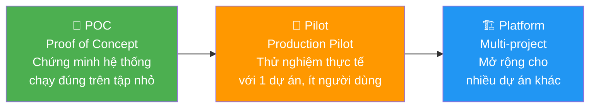
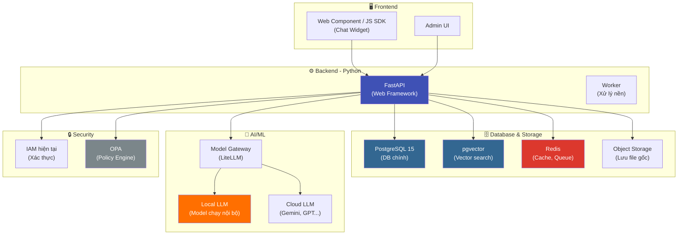
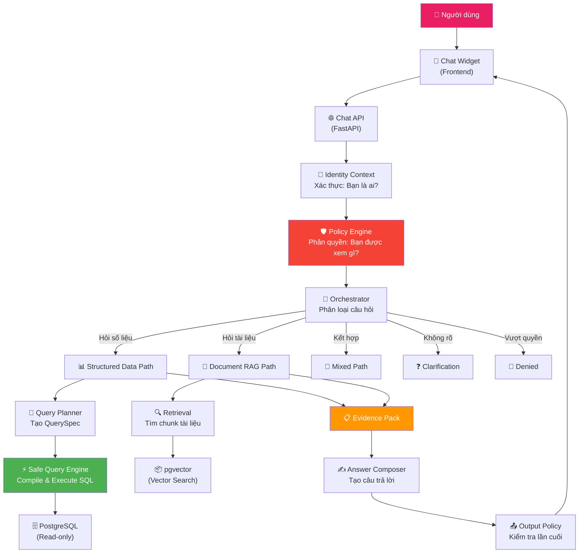
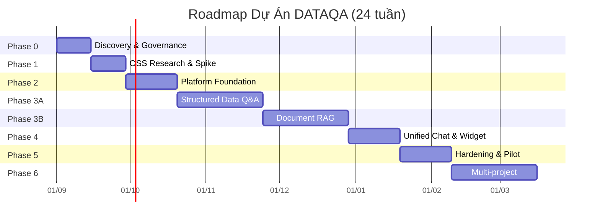

## 1. 🎯 Phát Biểu Lại Bài Toán

### Vấn đề thực tế là gì?

Hãy tưởng tượng bạn làm việc ở một công ty hoặc bệnh viện lớn. Dữ liệu nằm **rải rác** ở nhiều nơi: cơ sở dữ liệu này lưu doanh thu, cơ sở dữ liệu kia lưu thông tin bệnh nhân, tài liệu quy định thì nằm trong file Word/PDF... Khi sếp hỏi *"Doanh thu chi nhánh A tháng này bao nhiêu?"*, nhân viên phải:

1. **Nhờ đội IT** viết câu truy vấn SQL → chờ đợi lâu
2. **Tự tìm** trong đống tài liệu → dễ sai, mất thời gian
3. **Mỗi người hiểu KPI khác nhau** → báo cáo không nhất quán

### Bài toán cần giải quyết

> **Xây dựng một nền tảng "chatbot thông minh" cho phép người dùng hỏi bằng tiếng Việt tự nhiên, hệ thống tự động trả lời dựa trên dữ liệu có sẵn (database) và tài liệu nội bộ (file PDF, Word...), đảm bảo đúng quyền truy cập và có bằng chứng cho mỗi câu trả lời.**

### Nói đơn giản hơn

| Người dùng hỏi | Hệ thống làm gì |
|---|---|
| *"Doanh thu chi nhánh A tháng 7?"* | Tự tìm đúng bảng dữ liệu, truy vấn an toàn, trả số liệu kèm bằng chứng |
| *"Quy trình xử lý khiếu nại là gì?"* | Tìm đúng tài liệu, trích dẫn đúng trang/mục |
| *"Tỷ lệ X có đạt chuẩn quy định Y không?"* | Kết hợp cả số liệu + quy định, so sánh và trả lời |
| Câu hỏi vượt quyền | Từ chối lịch sự, **không lộ thông tin** |

### 3 Mốc quan trọng của dự án



---

## 2. 📐 Phạm Vi Dự Án (Scope)

### ✅ Trong phạm vi (Sẽ làm)

| # | Tính năng | Giải thích đơn giản |
|---|---|---|
| 1 | **Chat Widget** nhúng vào website | Ô chat nhỏ gắn vào trang web có sẵn, giống Messenger pop-up |
| 2 | **Project Registry** | Hệ thống quản lý cấu hình cho từng dự án/khách hàng |
| 3 | **Tích hợp IAM** | Dùng hệ thống đăng nhập hiện tại (không tạo user/pass riêng) |
| 4 | **RBAC + ABAC** | Phân quyền theo vai trò (Role) và thuộc tính (chi nhánh, phòng ban...) |
| 5 | **Semantic Catalog** | Danh mục "từ điển nghiệp vụ" — định nghĩa chính xác KPI, chỉ số |
| 6 | **Safe Query Engine** | Bộ máy truy vấn an toàn — LLM KHÔNG được tự viết SQL |
| 7 | **Document Management + RAG** | Upload tài liệu, OCR, chia chunk, tìm kiếm thông minh |
| 8 | **Multi-LLM Gateway** | Hỗ trợ nhiều model AI (local + cloud), điều phối thông minh |
| 9 | **Evidence Pack** | Mỗi câu trả lời kèm "bằng chứng" để kiểm tra |
| 10 | **Admin Control Plane** | Trang quản trị cho admin cấu hình mọi thứ |

### ❌ Ngoài phạm vi (KHÔNG làm ở MVP)

| Điều KHÔNG làm | Tại sao |
|---|---|
| Cho AI tự viết và chạy SQL | Quá nguy hiểm, có thể xóa/sửa dữ liệu |
| Cho AI ghi dữ liệu ngược | AI chỉ được **đọc**, không được **ghi** |
| AI tự ra quyết định lâm sàng/kinh doanh | Luôn cần người phê duyệt |
| Fine-tuning model ngay | Chưa cần thiết ở giai đoạn đầu |
| Knowledge Graph, Multi-agent | Quá phức tạp, chờ hệ thống cơ bản ổn |
| Fork toàn bộ Open Notebook/Dify | Dùng tham khảo thôi, không fork làm core |

---

## 3. 🛠️ Công Nghệ Sử Dụng

### Bảng tổng hợp công nghệ



### Giải thích từng công nghệ

| Công nghệ | Vai trò | Ví dụ dễ hiểu |
|---|---|---|
| **Python** | Ngôn ngữ chính cho backend | "Ngôn ngữ lập trình mà bạn đã học" |
| **FastAPI** | Web framework async cho API | Framework Python hiện đại, tự động tạo docs, tích hợp Pydantic |
| **PostgreSQL 15** | Database chính lưu mọi thứ | "Kho dữ liệu chính của hệ thống" |
| **pgvector** | Extension PostgreSQL cho vector search | Giúp tìm kiếm tài liệu "giống nghĩa", không chỉ "giống chữ" |
| **Redis** | Cache, message queue, rate limit | "Bộ nhớ tạm siêu nhanh" — tăng tốc hệ thống |
| **Object Storage** | Lưu file gốc (PDF, Word...) | Giống Google Drive nhưng cho server |
| **OPA** (Open Policy Agent) | Engine quyết định quyền truy cập | "Bảo vệ dữ liệu": ai được xem gì, không được xem gì |
| **LiteLLM** | Gateway cho nhiều LLM providers | "Trạm trung chuyển AI" — gọi Gemini, GPT, Ollama qua 1 cổng |
| **Alembic** | Quản lý migration database | Giúp thay đổi cấu trúc DB an toàn, có rollback |
| **Pydantic** | Validate dữ liệu trong Python | Kiểm tra dữ liệu đầu vào/đầu ra có đúng format không |
| **Web Component/JS SDK** | Chat widget nhúng web | Widget chat có thể gắn vào BẤT KỲ website nào |
| **SSE** (Server-Sent Events) | Streaming response | Câu trả lời hiện ra từ từ, giống ChatGPT |

### Kiến trúc: Modular Monolith

> [!TIP]
> **Modular Monolith** = Một ứng dụng duy nhất nhưng bên trong chia thành các **module độc lập**. Hãy tưởng tượng như một tòa nhà: cùng 1 tòa nhưng mỗi tầng có chức năng riêng (tầng 1: lễ tân, tầng 2: phòng họp...). Khác với **Microservices** là nhiều tòa nhà nhỏ riêng biệt — phức tạp hơn nhiều khi đội nhỏ.

---

## 4. 🧩 Phân Rã Bài Toán (Problem Decomposition)

### Tầng kiến trúc — từ người dùng đến dữ liệu



### Phân rã thành 14 Module chính

Mỗi module giống một "phòng ban" trong công ty — có trách nhiệm riêng, không được làm việc của phòng khác:

| # | Module | Nhiệm vụ | KHÔNG được làm |
|---|---|---|---|
| 1 | `identity_context` | Xác thực: bạn là ai, thuộc chi nhánh nào | Tạo user/role riêng |
| 2 | `project_registry` | Quản lý cấu hình từng dự án | Chạy truy vấn nghiệp vụ |
| 3 | `policy` | Quyết định ai được xem gì | Tự chạy query |
| 4 | `semantic_catalog` | Quản lý KPI, chỉ số, từ điển nghiệp vụ | Truy cập dữ liệu user |
| 5 | `query_planner` | Chuyển câu hỏi → kế hoạch truy vấn (QuerySpec) | Sinh SQL cuối |
| 6 | `safe_query` | Biên dịch QuerySpec → SQL, chạy an toàn | Nhận SQL thô từ AI |
| 7 | `knowledge` | Quản lý file, version, chunk, lifecycle | Tự quyết định quyền |
| 8 | `retrieval` | Tìm kiếm tài liệu (vector + text) | Tìm ngoài quyền |
| 9 | `model_gateway` | Điều phối local/cloud LLM | Tự fallback vượt trust boundary |
| 10 | `orchestration` | Điều phối luồng xử lý câu hỏi | Thay thế Policy Engine |
| 11 | `evidence` | Chuẩn hóa bằng chứng | Tự tạo số liệu |
| 12 | `answer` | Tạo câu trả lời theo vai trò | Thay đổi kết quả đã verify |
| 13 | `conversation` | Quản lý phiên chat, lịch sử | Lưu PHI thô mặc định |
| 14 | `audit` | Ghi log bảo mật, truy vết | Dùng thay debug log |

### 5 Domain Contract quan trọng nhất

Đây là 5 "bản hợp đồng dữ liệu" cốt lõi mà mọi module phải tuân theo:

| Contract | Ý nghĩa | Ví dụ |
|---|---|---|
| **IdentityContext** | "Bạn là ai?" — thông tin người dùng đã xác thực | user_id, tenant_id, branch_ids, roles, permissions |
| **PolicyDecision** | "Bạn được xem gì?" — quyết định cho phép/từ chối | allowed_metrics, mandatory_filters, forbidden_fields |
| **QuerySpec** | "Hỏi gì?" — kế hoạch truy vấn logic (KHÔNG có SQL) | metrics: ["revenue"], dimensions: ["branch"], time_range |
| **EvidencePack** | "Căn cứ ở đâu?" — bằng chứng cho câu trả lời | query_digest, document_id, page, section |
| **AnswerEnvelope** | "Trả lời thế nào?" — câu trả lời hoàn chỉnh | summary, scope, citations, limitations, suggested_actions |

---

## 5. 🏃 Thiết Kế Sprint Theo Mô Hình Agile

### Tổng quan Roadmap — 7 giai đoạn, ~24 tuần



> [!IMPORTANT]
> **Với đội 4-5 người** (phù hợp sinh viên/đội nhỏ): Phase 3A và 3B phải làm **tuần tự** (không song song). Tổng thời gian ước tính: **8-10 tháng**.

---

### 📋 Chi Tiết Từng Sprint

> [!TIP]
> Mỗi Sprint kéo dài **2 tuần**. Mình sẽ chia thành các sprint cụ thể với user story, task và tiêu chí nghiệm thu (Definition of Done) rõ ràng.

---

### 🔵 PHASE 0 — Discovery & Governance (Sprint 0: Tuần 1-2)

**Mục tiêu**: Hiểu rõ bài toán trước khi code

| Sprint | Thời gian | Sprint Goal |
|---|---|---|
| **Sprint 0** | Tuần 1-2 | Chốt scope, dữ liệu mẫu, và bộ câu hỏi kiểm tra |

**Backlog Sprint 0:**

- [ ] Chọn 1 dự án pilot (ví dụ: bệnh viện hoặc cửa hàng)
- [ ] Xác định 2-3 vai trò người dùng (giám đốc, trưởng phòng, nhân viên)
- [ ] Soạn 30-50 câu hỏi mẫu (golden questions)
- [ ] Định nghĩa 10 KPI chính (doanh thu, lượt khám, tỷ lệ...)
- [ ] Chọn 5-10 dimensions (chi nhánh, phòng ban, thời gian...)
- [ ] Chuẩn bị 20-50 tài liệu mẫu (quy trình, quy định...)
- [ ] Phân loại dữ liệu: public / internal / confidential / restricted
- [ ] Lập Golden Dataset v0 (câu hỏi + câu trả lời đúng mong đợi)
- [ ] Lập danh sách rủi ro ban đầu

**🚪 Gate G0**: Mỗi câu hỏi golden phải có: ai hỏi, quyền gì, nguồn dữ liệu nào, câu trả lời mong đợi, bằng chứng, trường hợp bị từ chối.

---

### 🟡 PHASE 1 — OSS Research & Architecture Spike (Sprint 1: Tuần 3-4)

**Mục tiêu**: Thử nghiệm công nghệ, chọn stack phù hợp

| Sprint | Thời gian | Sprint Goal |
|---|---|---|
| **Sprint 1** | Tuần 3-4 | Hoàn thành POC, chốt công nghệ chính |

**Backlog Sprint 1:**

- [ ] **POC 1**: pgvector vs RAGFlow — test với PDF text, scan, bảng
  - Đo: Recall@5, citation precision, tốc độ, tài nguyên
- [ ] **POC 2**: Custom QuerySpec vs Cube vs WrenAI
  - Test với 10 KPI, 5-10 dimensions, 30-50 câu hỏi
- [ ] **POC 3**: LiteLLM — test routing local/cloud, timeout, retry
- [ ] **POC 4**: Tham khảo Open Notebook — UX, ingestion flow
- [ ] Viết ADR (Architecture Decision Record) cho mỗi quyết định
- [ ] Chốt Build/Adopt/Trial cho từng thành phần

**🚪 Gate G1**: Mỗi giải pháp có Adopt/Trial/Reference/Reject rõ ràng. Architecture và Security phê duyệt.

**4 quyết định phải chốt cuối Phase 1:**
1. pgvector hay RAGFlow?
2. Custom compiler hay Cube?
3. Vai trò của local model?
4. Dữ liệu nào TUYỆT ĐỐI không gửi ra cloud?

---

### 🟢 PHASE 2 — Platform Foundation (Sprint 2-3: Tuần 5-7)

**Mục tiêu**: Xây nền móng — xác thực, phân quyền, audit

| Sprint | Thời gian | Sprint Goal |
|---|---|---|
| **Sprint 2** | Tuần 5-6 | IAM Adapter + Policy Engine + DB Schema cơ bản |
| **Sprint 3** | Tuần 7 | Audit, Model Registry, API skeleton, CI/CD |

**Backlog Sprint 2:**

- [ ] Setup project Python với cấu trúc modular monolith
- [ ] Tạo DB schema cơ bản (PostgreSQL + Alembic migrations)
- [ ] **IAM Adapter**: xác minh JWT, tạo IdentityContext
- [ ] **Policy Engine**: tích hợp OPA, RBAC + ABAC cơ bản
- [ ] **Project Registry**: CRUD project, version, manifest
- [ ] Viết unit tests cho identity validation
- [ ] Viết negative tests: token giả, hết hạn, thiếu claims → từ chối

**Backlog Sprint 3:**

- [ ] **Audit module**: ghi log opaque identity, action, decision, time
- [ ] **Model Registry**: cấu hình model profile, route
- [ ] API skeleton: FastAPI routes, middleware, error handling
- [ ] Setup CI/CD pipeline cơ bản
- [ ] Setup dev/staging environment
- [ ] Secret management (không hardcode password)
- [ ] Health check endpoints: `/health/live`, `/health/ready`

**🚪 Gate G2**:
- ✅ Token sai/thiếu → bị từ chối 100%
- ✅ Cross-tenant request → bị chặn 100%
- ✅ DB account chỉ read-only
- ✅ Không có PHI trong URL/log/trace
- ✅ Mọi quyết định có policy version + trace ID

---

### 🔵 PHASE 3A — Structured Data Q&A (Sprint 4-6: Tuần 8-12)

**Mục tiêu**: Hỏi số liệu bằng tiếng Việt → trả đúng kết quả

| Sprint | Thời gian | Sprint Goal |
|---|---|---|
| **Sprint 4** | Tuần 8-9 | Semantic Catalog + QuerySpec schema |
| **Sprint 5** | Tuần 10-11 | Safe Query Engine + Evidence Pack |
| **Sprint 6** | Tuần 12 | Tích hợp end-to-end, regression test |

**Backlog Sprint 4:**

- [ ] **Semantic Catalog**: schema cho metric, dimension, relationship
- [ ] CRUD semantic package: Draft → Approved → Published
- [ ] Mỗi field có: tên nghiệp vụ, mô tả, kiểu dữ liệu, đơn vị, synonym
- [ ] **QuerySpec schema**: JSON Schema cho kế hoạch truy vấn
- [ ] **Query Planner**: gọi LLM để chuyển câu hỏi → QuerySpec
- [ ] Validate QuerySpec bằng Pydantic
- [ ] Xử lý câu hỏi mơ hồ → hỏi lại (clarification)

**Backlog Sprint 5:**

- [ ] **SQL Compiler**: QuerySpec → parameterized SQL
- [ ] **AST Guard**: parse SQL, cấm DDL/DML/multi-statement
- [ ] Chèn mandatory filters (tenant_id, branch_id) tự động
- [ ] Statement timeout, row limit, cost limit
- [ ] Chạy trên read-only replica, có RLS
- [ ] **Numeric Verifier**: kiểm tra total, rate, null, division-by-zero
- [ ] **Evidence Pack**: tạo bằng chứng cho mỗi query
- [ ] Masking dữ liệu nhạy cảm

**Backlog Sprint 6:**

- [ ] Tích hợp luồng: câu hỏi → identity → policy → plan → query → evidence → answer
- [ ] Chạy Golden Dataset: 10 KPI trọng yếu phải đúng 100%
- [ ] Overall accuracy ≥ 90%
- [ ] Regression test cho security cases
- [ ] Câu hỏi mơ hồ phải hỏi lại, không đoán bừa

**🚪 Gate G3A**:
- ✅ 100% KPI trọng yếu chính xác
- ✅ Overall result accuracy ≥ 90%
- ✅ Không DDL/DML/object ngoài allowlist
- ✅ Mọi câu trả lời có scope/filter/as-of
- ✅ Câu hỏi mơ hồ → clarification

---

### 🟡 PHASE 3B — Document RAG (Sprint 7-9: Tuần 13-17)

**Mục tiêu**: Hỏi tài liệu → trả đúng nội dung, trích dẫn chính xác

| Sprint | Thời gian | Sprint Goal |
|---|---|---|
| **Sprint 7** | Tuần 13-14 | Document Lifecycle + Ingestion Pipeline |
| **Sprint 8** | Tuần 15-16 | ACL-aware Retrieval + Vector Search |
| **Sprint 9** | Tuần 17 | Citation, Evidence, Regression |

**Backlog Sprint 7:**

- [ ] **Upload pipeline**: validate MIME, signature, size, checksum
- [ ] Malware scan + quarantine
- [ ] **OCR/Extraction**: text, heading, table, metadata
- [ ] Gắn metadata: owner, project, tenant, classification, ACL
- [ ] Document lifecycle: UPLOADED → PROCESSING → REVIEW → APPROVED → PUBLISHED
- [ ] **Chunking**: chia tài liệu thành chunks, kế thừa ACL
- [ ] Embedding generation (pgvector)

**Backlog Sprint 8:**

- [ ] **Hybrid search**: kết hợp full-text + vector search
- [ ] **ACL filter TRƯỚC retrieval** — không retrieve-all rồi lọc sau
- [ ] Reranking kết quả
- [ ] Chunk giữ: document_id, version, page, section, checksum
- [ ] Xử lý tài liệu hết hiệu lực (superseded/revoked)
- [ ] Ngăn indirect prompt injection từ tài liệu

**Backlog Sprint 9:**

- [ ] **Exact citation**: trỏ đúng phiên bản, trang, mục
- [ ] Document Evidence Pack
- [ ] Revoke/delete → xóa chunk, vector, summary, cache
- [ ] Chạy Golden Dataset cho RAG
- [ ] Retrieval Recall@5 ≥ 85%
- [ ] Citation precision ≥ 95%

**🚪 Gate G3B**:
- ✅ Không chunk trái quyền vào context
- ✅ Recall@5 ≥ 85%
- ✅ Citation precision ≥ 95%
- ✅ Tài liệu revoked biến mất đúng SLA
- ✅ Trace đúng page/section/version

---

### 🟢 PHASE 4 — Unified Chat & Widget (Sprint 10-11: Tuần 18-20)

**Mục tiêu**: Giao diện hoàn chỉnh, kết hợp data + document

| Sprint | Thời gian | Sprint Goal |
|---|---|---|
| **Sprint 10** | Tuần 18-19 | Orchestrator + Answer Envelope + Chat Widget |
| **Sprint 11** | Tuần 20 | Admin UI + Feedback + Mixed answers |

**Backlog Sprint 10:**

- [ ] **Orchestrator**: state machine phân loại và điều phối
  - RECEIVED → VERIFIED → AUTHORIZED → CLASSIFIED → PLANNED → EXECUTED → VERIFIED → COMPOSED → AUDITED → COMPLETED
- [ ] **Answer Envelope**: tổng hợp data + document evidence
- [ ] **Chat Widget**: Web Component / JS SDK
- [ ] SSE streaming (hiện câu trả lời từ từ)
- [ ] Responsive desktop/mobile
- [ ] Citation panel hiển thị bằng chứng
- [ ] Scope/as-of/limitation disclosure

**Backlog Sprint 11:**

- [ ] **Admin UI**: quản lý project, semantic, policy, document, model
- [ ] Feedback button (user đánh giá câu trả lời)
- [ ] Mixed questions: kết hợp số liệu + quy định
- [ ] Tách rõ: factual answer vs. interpretation vs. suggested action
- [ ] Action suggestion cần human approval
- [ ] Maker-checker cho thay đổi nhạy cảm

**🚪 Gate G4**:
- ✅ Mixed question kết hợp đúng data + regulation
- ✅ Tách nội bộ/ngoài rõ ràng
- ✅ Client không thể đổi project/scope
- ✅ Action nguy cơ → human approval
- ✅ JSON contract valid

---

### 🔴 PHASE 5 — Security Hardening & Pilot (Sprint 12-13: Tuần 21-23)

**Mục tiêu**: Kiểm thử bảo mật toàn diện, thử nghiệm thực tế

| Sprint | Thời gian | Sprint Goal |
|---|---|---|
| **Sprint 12** | Tuần 21-22 | Security testing toàn diện |
| **Sprint 13** | Tuần 23 | Controlled pilot với người dùng thật |

**Backlog Sprint 12:**

- [ ] **Identity tests**: token giả, hết hạn, replay, thiếu claim
- [ ] **Database tests**: SQL injection, DDL/DML, pg_sleep, RLS bypass
- [ ] **Document tests**: MIME spoof, zip bomb, prompt injection trong file
- [ ] **Model tests**: jailbreak, forbidden fallback, hallucination
- [ ] **Platform tests**: cache leak, Redis leak, secret in log
- [ ] Rate limiting, DoS protection
- [ ] SBOM scan, dependency vulnerabilities
- [ ] Backup/restore test
- [ ] Viết incident/rollback/disable-provider runbook

**Backlog Sprint 13:**

- [ ] **Pilot**: 15-30 users, 2-3 roles, 1 project, 2 tuần
- [ ] Daily critical review
- [ ] Weekly regression test
- [ ] Feedback collection & analysis
- [ ] Performance monitoring (p95 latency)
- [ ] No autonomous action cho tất cả

**🚪 Gate G5**:
- ✅ Zero unauthorized disclosure
- ✅ Zero PHI in telemetry
- ✅ 100% audit completeness
- ✅ KPI accuracy, citation, latency đạt mục tiêu
- ✅ Có runbook cho mọi sự cố
- ✅ Data/Security Owner phê duyệt go-live

---

### 🟣 PHASE 6 — Multi-project (Sprint 14-16: Tuần 24+)

**Mục tiêu**: Mở rộng cho dự án thứ 2+ chủ yếu bằng cấu hình

| Sprint | Thời gian | Sprint Goal |
|---|---|---|
| **Sprint 14** | Tuần 24-25 | Connector SDK + Project templates |
| **Sprint 15** | Tuần 26-27 | Export/Import + Promotion workflow |
| **Sprint 16** | Tuần 28-29 | Onboard project 2 + Quota dashboard |

**🚪 Gate G6**:
- ✅ Project thứ 2 onboard ≤ 5 ngày
- ✅ ≥ 80% bằng config, không sửa core
- ✅ Project A không regression khi triển khai Project B

---

## 6. 📊 Tóm Tắt Sprint Board

| Sprint | Phase | Tuần | Deliverable chính | Ưu tiên |
|---|---|---|---|---|
| 0 | Discovery | 1-2 | Golden Dataset v0, scope | 🔴 P0 |
| 1 | Research | 3-4 | POC reports, ADR, tech decisions | 🔴 P0 |
| 2 | Foundation | 5-6 | IAM, Policy, DB schema | 🔴 P0 |
| 3 | Foundation | 7 | Audit, Model Registry, CI/CD | 🔴 P0 |
| 4 | Structured QA | 8-9 | Semantic Catalog, QuerySpec | 🔴 P0 |
| 5 | Structured QA | 10-11 | Safe Query, Evidence | 🔴 P0 |
| 6 | Structured QA | 12 | E2E integration, accuracy test | 🔴 P0 |
| 7 | Document RAG | 13-14 | Upload, OCR, Chunking | 🔴 P0 |
| 8 | Document RAG | 15-16 | ACL Retrieval, Vector Search | 🔴 P0 |
| 9 | Document RAG | 17 | Citation, RAG regression | 🔴 P0 |
| 10 | Unified Chat | 18-19 | Widget, Orchestrator, SSE | 🔴 P0 |
| 11 | Unified Chat | 20 | Admin UI, Feedback, Mixed Q | 🔴 P0 |
| 12 | Hardening | 21-22 | Security testing toàn diện | 🔴 P0 |
| 13 | Pilot | 23 | Controlled pilot 15-30 users | 🔴 P0 |
| 14-16 | Multi-project | 24-29 | SDK, Templates, Project 2 | 🟡 P1 |

---

## 7. 💡 Lời Khuyên Cho Sinh Viên

> [!TIP]
> ### Chiến lược làm bài tốt nhất
> 
> 1. **Đừng cố làm hết** — Tập trung Phase 0-4 là đủ ấn tượng cho đồ án
> 2. **Bắt đầu từ cái nhỏ nhất** — 1 project, 3-5 KPI, 10 tài liệu
> 3. **Demo được > Code đẹp** — Ưu tiên luồng end-to-end chạy được
> 4. **Security là điểm cộng lớn** — Nếu bạn demo được phân quyền đúng, giảng viên sẽ rất ấn tượng
> 5. **Golden Dataset = Bài kiểm tra** — Chuẩn bị 20-30 câu hỏi test, show kết quả so sánh

### Thứ tự ưu tiên nếu thời gian hạn chế

```
1️⃣ Chat API + IAM cơ bản (ai hỏi?)
2️⃣ QuerySpec + Safe Query (hỏi số liệu đơn giản)
3️⃣ Document RAG cơ bản (hỏi tài liệu)
4️⃣ Chat Widget (giao diện đẹp)
5️⃣ Policy Engine (phân quyền nâng cao)
6️⃣ Admin UI (quản trị)
```

---

## 8. 📚 Thuật Ngữ Nhanh

| Thuật ngữ | Nghĩa đơn giản |
|---|---|
| **LLM** | Large Language Model — mô hình AI hiểu ngôn ngữ (ChatGPT, Gemini...) |
| **RAG** | Retrieval-Augmented Generation — AI tìm tài liệu trước rồi mới trả lời |
| **IAM** | Identity & Access Management — hệ thống quản lý ai đăng nhập, quyền gì |
| **RBAC** | Role-Based Access Control — phân quyền theo vai trò (admin, user, viewer) |
| **ABAC** | Attribute-Based Access Control — phân quyền theo thuộc tính (chi nhánh, phòng ban) |
| **JWT** | JSON Web Token — "vé" điện tử chứng minh bạn đã đăng nhập |
| **RLS** | Row-Level Security — PostgreSQL chỉ cho bạn xem dòng dữ liệu được phép |
| **pgvector** | Extension PostgreSQL lưu và tìm kiếm vector (cho AI search) |
| **SSE** | Server-Sent Events — server gửi dữ liệu liên tục cho client (streaming) |
| **QuerySpec** | Kế hoạch truy vấn logic — KHÔNG phải SQL, mà là "AI muốn hỏi gì" |
| **Evidence Pack** | Gói bằng chứng — chứng minh câu trả lời đến từ đâu |
| **Modular Monolith** | Một ứng dụng nhưng chia module rõ ràng bên trong |
| **OPA** | Open Policy Agent — engine quyết định quyền truy cập |
| **OCR** | Optical Character Recognition — chuyển ảnh/scan thành text |
| **PHI** | Protected Health Information — thông tin y tế cá nhân (cần bảo vệ tuyệt đối) |
| **CI/CD** | Continuous Integration/Deployment — tự động test và deploy code |
| **Alembic** | Tool quản lý thay đổi cấu trúc database trong Python |
| **Pydantic** | Thư viện Python validate dữ liệu theo schema |
