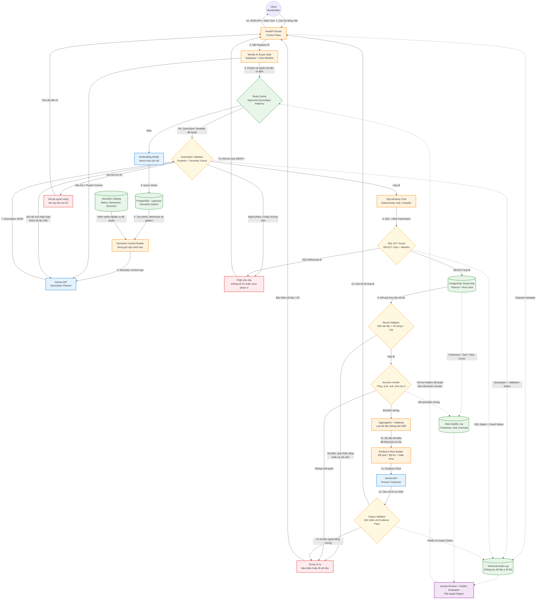

# KIẾN TRÚC WORKFLOW 1 — DATAQA PIPELINE (STRUCTURED QUERY & QUALITY GUARD)

Tài liệu mô tả chi tiết luồng xử lý truy vấn dữ liệu có cấu trúc (Structured Data QA), cơ chế kiểm soát bảo mật đa tầng, xác thực kết quả và kiểm soát chất lượng AI Model theo định hướng fail-closed.

---

## 📌 Các điểm cốt lõi của Workflow 1

1. **Kiểm soát bảo mật Fail-Closed**:
   - Bất kỳ vi phạm nào (Pydantic validation, AST guard, Numeric verification, Output hallucination) đều dẫn tới nhánh an toàn (`Clarify`, `Abort`, `Block`) và trả về `Router` dưới dạng thông báo an toàn, không rò rỉ thông tin nội bộ.
2. **Cách ly DDL & Schema**:
   - Model (Gemini1) chỉ nhận **Semantic Context hẹp** (logical metrics, dimensions, synonyms) từ `Semantic Catalog`, không bao giờ nhận DDL vật lý hay tên bảng thực tế.
3. **Biên dịch SQL an toàn**:
   - SQL được sinh hoàn toàn bằng **SQLAlchemy Core** (deterministic compiler) kết hợp tham số hóa (Bind Parameters) và kiểm tra qua **SQL AST Guard**.
4. **Không gửi dữ liệu thô ra ngoài**:
   - Dữ liệu thô từ DB được tổng hợp, khử định danh qua `DataMinimizer` và đóng gói thành `Evidence Pack` có kèm timestamp & kiểm chứng trước khi đưa vào `Gemini2` sinh câu trả lời tự nhiên.
5. **Đóng kín chu trình chất lượng & Golden Pattern**:
   - Audit Log & Data Quality Log được thu thập tự động, đưa qua bước Review để cập nhật Golden Patterns có gắn Semantic Version vào Cache.