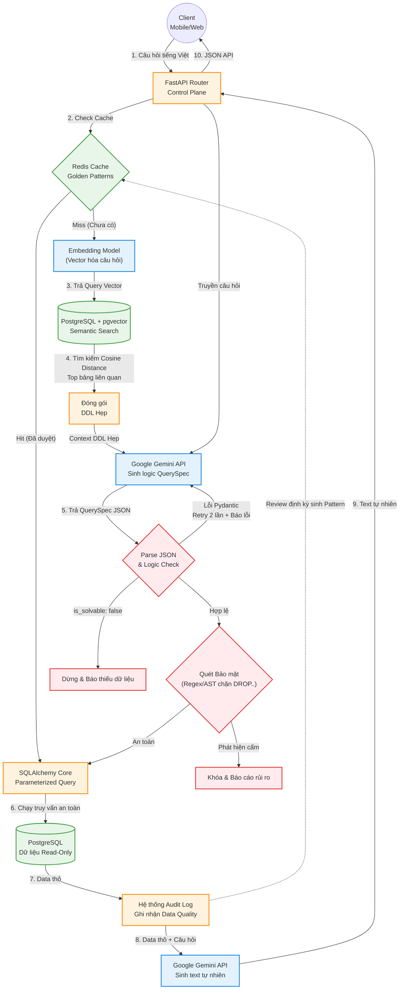

```mermaid
graph TD
    %% Định nghĩa Node
    User(("Client<br/>Mobile/Web"))
    Router["FastAPI Router<br/>Control Plane"]
    Cache{"Redis Cache<br/>Golden Patterns"}

    Embedder["Embedding Model<br/>(Vector hóa câu hỏi)"]
    VectorDB[("PostgreSQL + pgvector<br/>Semantic Search")]
    ContextBuilder["Đóng gói<br/>DDL Hẹp"]

    Gemini1["Google Gemini API<br/>Sinh logic QuerySpec"]
    Retry{"Parse JSON<br/>& Logic Check"}

    Security{"Quét Bảo mật<br/>(Regex/AST chặn DROP..)"}
    SQLBuilder["SQLAlchemy Core<br/>Parameterized Query"]
    DB[("PostgreSQL<br/>Dữ liệu Read-Only")]

    Logger["Hệ thống Audit Log<br/>Ghi nhận Data Quality"]
    Gemini2["Google Gemini API<br/>Sinh text tự nhiên"]
    Abort["Dừng & Báo thiếu dữ liệu"]
    Block["Khóa & Báo cáo rủi ro"]

    %% Luồng đi
    User -->|"1. Câu hỏi tiếng Việt"| Router
    Router -->|"2. Check Cache"| Cache

    Cache -->|"Hit (Đã duyệt)"| SQLBuilder
    Cache -->|"Miss (Chưa có)"| Embedder

    Embedder -->|"3. Trả Query Vector"| VectorDB
    VectorDB -->|"4. Tìm kiếm Cosine Distance<br/>Top bảng liên quan"| ContextBuilder
    ContextBuilder -->|"Context DDL Hẹp"| Gemini1

    Router -->|"Truyền câu hỏi"| Gemini1

    Gemini1 -->|"5. Trả QuerySpec JSON"| Retry
    Retry -->|"Lỗi Pydantic<br/>Retry 2 lần + Báo lỗi"| Gemini1
    Retry -->|"is_solvable: false"| Abort
    Retry -->|"Hợp lệ"| Security

    Security -->|"Phát hiện cấm"| Block
    Security -->|"An toàn"| SQLBuilder

    SQLBuilder -->|"6. Chạy truy vấn an toàn"| DB
    DB -->|"7. Data thô"| Logger

    Logger -.->|"Review định kỳ sinh Pattern"| Cache
    Logger -->|"8. Data thô + Câu hỏi"| Gemini2
    Gemini2 -->|"9. Text tự nhiên"| Router

    Router -->|"10. JSON API"| User

    %% Styling
    classDef ai fill:#e3f2fd,stroke:#1e88e5,stroke-width:2px;
    classDef db fill:#e8f5e9,stroke:#43a047,stroke-width:2px;
    classDef core fill:#fff3e0,stroke:#fb8c00,stroke-width:2px;
    classDef danger fill:#ffebee,stroke:#e53935,stroke-width:2px;

    class Gemini1,Gemini2,Embedder ai;
    class VectorDB,DB,Cache db;
    class Router,ContextBuilder,SQLBuilder,Logger core;
    class Security,Retry,Abort,Block danger;
```