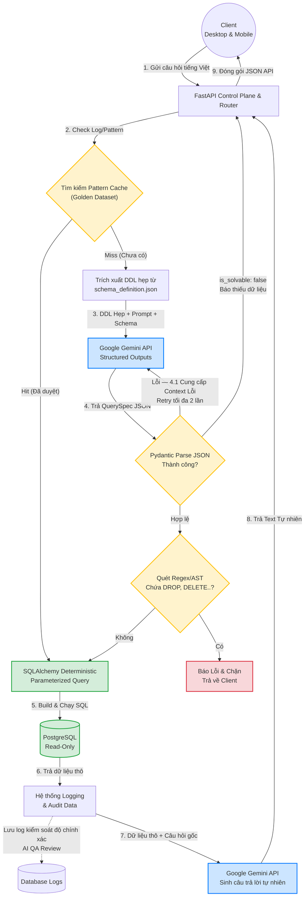

```mermaid
graph TD
    %% Khai báo các Node
    User(("Client<br/>Desktop & Mobile"))
    Router["FastAPI Control Plane & Router"]
    Cache{"Tìm kiếm Pattern Cache<br/>(Golden Dataset)"}
    SchemaExt["Trích xuất DDL hẹp từ<br/>schema_definition.json"]
    Gemini1["Google Gemini API<br/>Structured Outputs"]
    Retry{"Pydantic Parse JSON<br/>Thành công?"}
    Security{"Quét Regex/AST<br/>Chứa DROP, DELETE..?"}
    SQLBuilder["SQLAlchemy Deterministic<br/>Parameterized Query"]
    DB[("PostgreSQL<br/>Read-Only")]
    Logger["Hệ thống Logging<br/>& Audit Data"]
    Gemini2["Google Gemini API<br/>Sinh câu trả lời tự nhiên"]
    Alert["Báo Lỗi & Chặn<br/>Trả về Client"]
    DataStore[("Database Logs")]

    %% Kết nối
    User -->|"1. Gửi câu hỏi tiếng Việt"| Router
    Router -->|"2. Check Log/Pattern"| Cache

    Cache -->|"Hit (Đã duyệt)"| SQLBuilder
    Cache -->|"Miss (Chưa có)"| SchemaExt

    SchemaExt -->|"3. DDL Hẹp + Prompt + Schema"| Gemini1
    Gemini1 -->|"4. Trả QuerySpec JSON"| Retry

    Retry -->|"Lỗi — 4.1 Cung cấp Context Lỗi<br/>Retry tối đa 2 lần"| Gemini1
    Retry -->|"Hợp lệ"| Security
    Retry -->|"is_solvable: false<br/>Báo thiếu dữ liệu"| Router

    Security -->|"Có"| Alert
    Security -->|"Không"| SQLBuilder

    SQLBuilder -->|"5. Build & Chạy SQL"| DB

    DB -->|"6. Trả dữ liệu thô"| Logger
    Logger -.->|"Lưu log kiểm soát độ chính xác<br/>AI QA Review"| DataStore

    Logger -->|"7. Dữ liệu thô + Câu hỏi gốc"| Gemini2
    Gemini2 -->|"8. Trả Text Tự nhiên"| Router

    Router -->|"9. Đóng gói JSON API"| User

    %% Styling
    classDef safe fill:#d4edda,stroke:#28a745,stroke-width:2px
    classDef warning fill:#fff3cd,stroke:#ffc107,stroke-width:2px
    classDef danger fill:#f8d7da,stroke:#dc3545,stroke-width:2px
    classDef ai fill:#cce5ff,stroke:#007bff,stroke-width:2px

    class DB,SQLBuilder safe
    class Retry,Security,Cache warning
    class Alert danger
    class Gemini1,Gemini2 ai
```